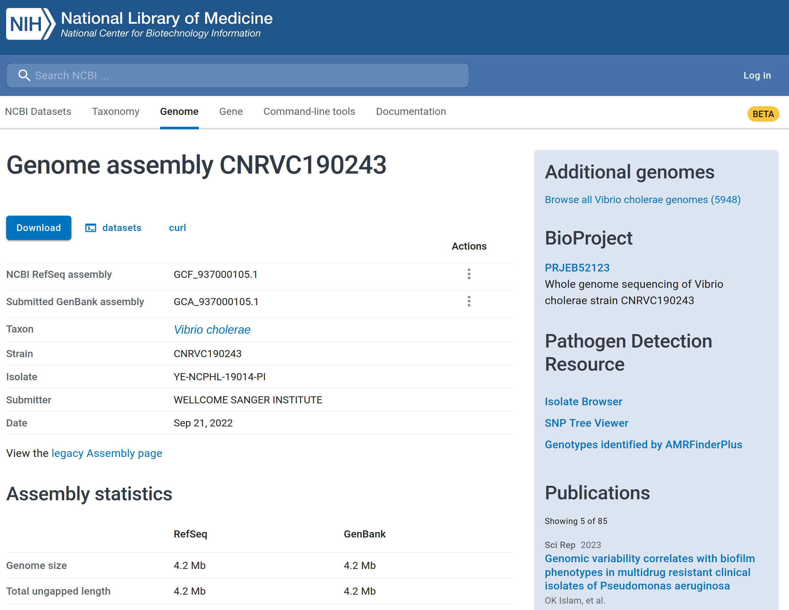
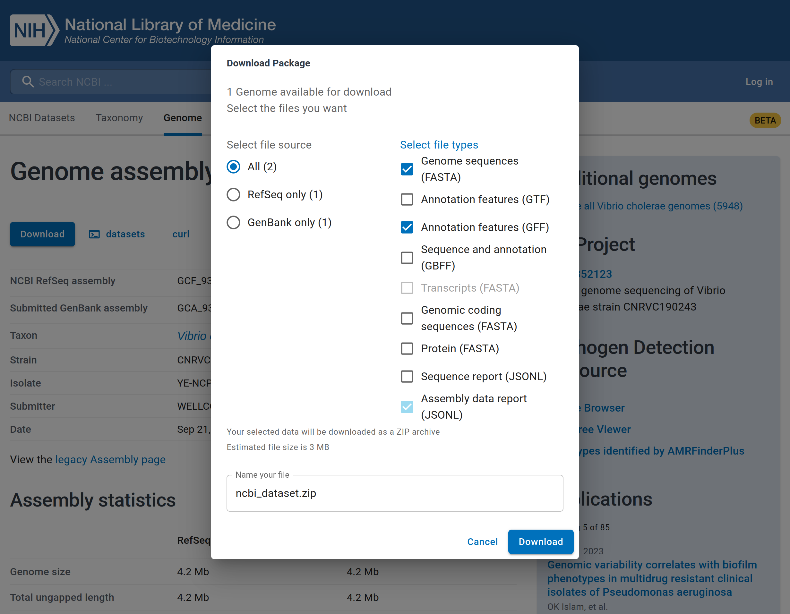

::: {.callout-tip}
#### Learning Objectives

- Recognise the importance of organising your files and folders when starting a bioinformatic analysis.
- Investigate the content of the raw sequencing FASTQ files.
- Download available public reference genomes from public databases.
:::


## Data overview

In the examples used throughout these materials we will use sequencing data for the cholera bacterium _Vibrio cholerae_. 
The material was obtained from cultured samples, so each sequencing library was prepared from DNA extracted from a single plate colony. 
We have two datasets, summarised below.

::: {.panel-tabset}
### Dataset 1

This dataset is used for the examples shown in the main text. 
These data are not available for download (see dataset 2 instead).

- Number of samples: 10
- Origin: unspecified country (due to privacy concerns), but all patients showed AWD symptoms, suspected to be due to a local cholera outbreak.
- Sample preparation: stool samples were collected and used for plate culture in media appropriate to grow _Vibrio_ species; DNA was prepared using the Zymobiomics Fungal/Bacterial DNA miniprep kit; ONT library preparation and barcoding were done using standard ONT kits. 
- Sequencing platform: MinION
- Basecalling: Guppy version 6 in "fast" mode

### Dataset 2

This dataset is used for the exercises and can be downloaded from [here](TODO).
This is part of a public dataset from [Ambroise et al. 2003](https://doi.org/10.1101/2023.02.17.23286076) (see publication for further details). 

- Number of samples: 5
- Origin: samples from cholera patients from the Democratic Republic of the Congo.
- Sample preparation: stool samples were collected and used for plate culture in media appropriate to grow _Vibrio_ species; ONT library preparation and barcoding were done using standard kits.
- Sequencing platform: MinION
- Basecalling: Guppy version 6 in high accuracy ("hac") mode (this information is not actually specified in the manuscript, but we are making this assumption just as an example).
:::

:::{.callout-note}
#### Using your data

If you are attending one of our workshops that includes lab training, you can use the data produced during the workshop in the exercises.
:::


## Setting up Directories and Preparing files

For convenience and reproducibility of any bioinformatic analysis, it is good practice to set up several directories before starting your analysis. 
It is also convenient to download any required files from public databases, such as reference genomes. 

You can do this from your file browser or using the command line. 
We recommend starting with an empty directory that will be used to store all the data and scripts used during the analysis. 
In this case, we will work from a directory in our _Documents_ called `awd_workshop`.
Here are some recommended directories that you should create inside it: 

- `data` - for storing raw sequencing data (fastq files).
- `scripts` - for storing all scripts for running analysis at different stages.
- `results` - for storing results of the pipeline.
- `reports` - for storing reports of the analysis.
- `resources` - for storing files from public repositories, such as reference genomes and other databases we will require during our analysis.

:::{.callout-note}
#### Note for workshop attendees

If you're attending one of our live workshops, we've already prepared the data for you to save time in downloading and preparing the files. 
However, you can read this section to understand where the data came from.
:::

From the command line, you can create directories using the command `mkdir`. 
In our example, we will be working from our Documents folder, which is located in `~/Documents/` (remember that `~` is a shortcut to your home directory). 

We start by moving into that directory: 

```bash
cd ~/Documents
```

And then we create a folder for our project. 
We call this folder `awd_workshop`:

```bash
mkdir awd_workshop
```

We can then move into that folder using `cd` again:

```bash
cd awd_workshop
```

Finally, we create all the sub-directories to save our different pieces of data: 

```bash
# create several directories simultaneously with a single command
mkdir data scripts results resources
```


## Sequencing files

Our bioinformatics analysis will start by first looking at the FASTQ files generated by the basecalling software called _Guppy_. 
This software converts the Nanopore electrical signal to sequence calls and stores the results in a directory named **fastq_pass**, which contains a subdirectory for each sample barcode used. 

We have copied/pasted the `fastq_pass` folder from Guppy into our `data` directory simply using our <i class="fa-solid fa-folder"></i> file browser.
We can use the command `ls` to view what's inside it:

```bash
ls data/fastq_pass
```

```
barcode25  barcode27  barcode29  barcode31  barcode33
barcode26  barcode28  barcode30  barcode32  barcode34
```

In our example, we had 10 samples with the barcodes shown (yours might look different). 

If you wanted to quickly look at how many reads you have in each file, you could use some command line tricks: 

- first combine all the FASTQ files from a barcode using `zcat` (we use the `z*` variant of the `cat` command because our files are compressed)
- pipe the output to the `wc -l` to count the number of lines in the combined files
- then divide that number by 4, because each sequence is represented in 4 lines in FASTQ files

For example, for `barcode25` we could do: 

```bash
zcat data/fastq_pass/barcode25/*.fastq.gz | wc -l
```

```
484416
```

If we divide that value by 4, we can determine that we have 121,104 reads in this sample. 


:::{.callout-note collapse=true}
#### Advanced: automatically determining read number across barcodes

The following code is more advanced, but it allows us to determine how many reads we have in each barcode without having to type each command individually. 
Instead, we use a _for loop_ to automatically perform our task of counting reads for each barcode.

If you feel confortable using the command line, you can try it out.

```bash
for barcode in data/fastq_pass/*
do
  # count total lines in all files within a barcode folder
  nlines=$(zcat $barcode/* | wc -l)
  
  # divide the value by 4 (each sequence is represented in 4 lines in FASTQ files)
  nreads=$(( $nlines / 4 ))
  
  # print the result
  echo "Reads in ${barcode}: ${nreads}"
done
```

```
Reads in data/fastq_pass/barcode25: 121104
Reads in data/fastq_pass/barcode26: 202685
Reads in data/fastq_pass/barcode27: 247162
Reads in data/fastq_pass/barcode28: 262453
Reads in data/fastq_pass/barcode29: 157356
Reads in data/fastq_pass/barcode30: 286582
Reads in data/fastq_pass/barcode31: 187090
Reads in data/fastq_pass/barcode32: 120555
Reads in data/fastq_pass/barcode33: 121991
Reads in data/fastq_pass/barcode34: 102589
```

To learn more about _for loops_ see our [Unix course materials](https://cambiotraining.github.io/unix-shell/materials/02-programming/03-loops.html). 
:::


## Metadata

Having metadata (data about our raw FASTQ files) is important in order to have a clear understanding on how the samples and raw data were generated. 
Two key pieces of information for genomic surveillance are the **date** of sample collection and the **geographic location** of that sample. 
This information can be used to understand which strains of a pathogen are circulating in an area at any given time.
Information like the **protocol** used for preparing the samples (e.g. metagenomic or culture-based) and the **sequencing platform** used (Illumina or ONT) are also crucial for the bioinformatic analysis steps.
All this is important for downstream analysis and to further our interpretation of the results and reporting.

Privacy concerns need to be considered when collecting and storing sensitive data.
However, it should be noted that sensitive data can still be collected, even if it is not shared publicly. 
Such sensitive information may still be useful for the relevant public health authorities, who may use those sensitive information for a finer analysis of the data. 
For example, epidemiological analysis will require individual-level metadata ("person, place, time") to be available, in order to track the dynamics of transmission within a community.

The most general advice when it comes to metadata collection is: **record as much information about each sample as possible**!

Some of this information can be stored in a CSV file, created with a spreadsheet software such as _Excel_. 

<!-- TODO: add example metadata -->


## Public genomes

In our example, we are working with cultured samples of the _Vibrio cholerae_ bacteria, the causative pathogen of the cholera disease, of which AWD is a major symptom. 
Therefore, we will download a public genomes for this pathogen, which will later be used to understand how our strains relate to others previously sequenced. 

There are many complete genomes available for _V. cholerae_, which can be [downloaded from the NCBI public database](https://www.ncbi.nlm.nih.gov/datasets/genome/?taxon=666&annotated_only=true&refseq_annotation=true&typical_only=true).
The first full genome was [published in 2000](https://doi.org/10.1038/35020000) from the clinical isolate N16961, which belongs to serogroup O1, serotype Inaba, biotype El Tor. 
This is a typical strain from the current pandemic, often referred to as '7PET' (7th pandemic El Tor).

The [_Vibriowatch_ website](https://genomic-surveillance-for-vibrio-cholerae-using-vibriowatch.readthedocs.io/en/latest/mlst.html#compare-your-isolate-to-vibriowatch-s-reference-genomes) (which we will detail more about in a [later chapter](../03-typing/01-pathogenwatch.md)) also provides a set of 17 'reference genomes', 14 of which belong to the current pandemic (7PET) lineages. 
Their reference genomes are named as 'Wi_Tj' where 'W' stands for a **Wave** and 'i' is its number, and 'T' stands for **Transmission** event and 'j' its number. 
For instance, a W1_T1 strain means "wave one transmission event one". 

For example, we can look at a public strain related to 'W3_T13', associated with a cholera outbreak in Yemen in 2019.
This sample is available from the following link: https://www.ncbi.nlm.nih.gov/datasets/genome/GCF_937000105.1/.

From the link above you can see information about the genome assembly of this strain, as shown below. 
The assembly is complete with 99.69% of the genome recovered.



In that same page, you will see a "Download" button. 
When you click that button, the pop-up window will be displayed as illustrated in the image below.



The reference genome sequence can be selected by ticking 'Genome sequences (FASTA)' and the gene annotation by ticking 'Annotation features (GFF)' formats. 
You can change the name of the file that will be downloaded and finally, click the 'Download' button to download the reference genome assembly.

The downloaded file is compressed as a Zip file, which you can uncompress and copy the files to your project folder. 
We have already downloaded this sample and stored it in the directory `resources/vibrio_genomes`, along with 62 other complete genomes collected since 2019, also downloaded from the [NCBI website](https://www.ncbi.nlm.nih.gov/datasets/genome/?taxon=666&annotated_only=true&refseq_annotation=true&typical_only=true&assembly_level=3%3A3&release_year=2019%3A2023). 
We will later use these genomes for our phylogenetic analysis. 

We can check all our genomes with the `ls` command: 

```bash
ls resources/vibrio_genomes
```

```
GCF_004117115.1_ASM411711v1_genomic.fna   GCF_013085165.1_ASM1308516v1_genomic.fna  GCF_019458445.1_ASM1945844v1_genomic.fna
GCF_004328575.1_ASM432857v1_genomic.fna   GCF_013357605.1_ASM1335760v1_genomic.fna  GCF_019458465.1_ASM1945846v1_genomic.fna
GCF_008369605.1_ASM836960v1_genomic.fna   GCF_013357625.1_ASM1335762v1_genomic.fna  GCF_019504425.1_ASM1950442v1_genomic.fna
GCF_009646135.1_ASM964613v1_genomic.fna   GCF_013357645.1_ASM1335764v1_genomic.fna  GCF_019704175.1_ASM1970417v1_genomic.fna

... more output ommitted ...
```

## Summary

::: {.callout-tip}
#### Key Points

- TODO
:::
