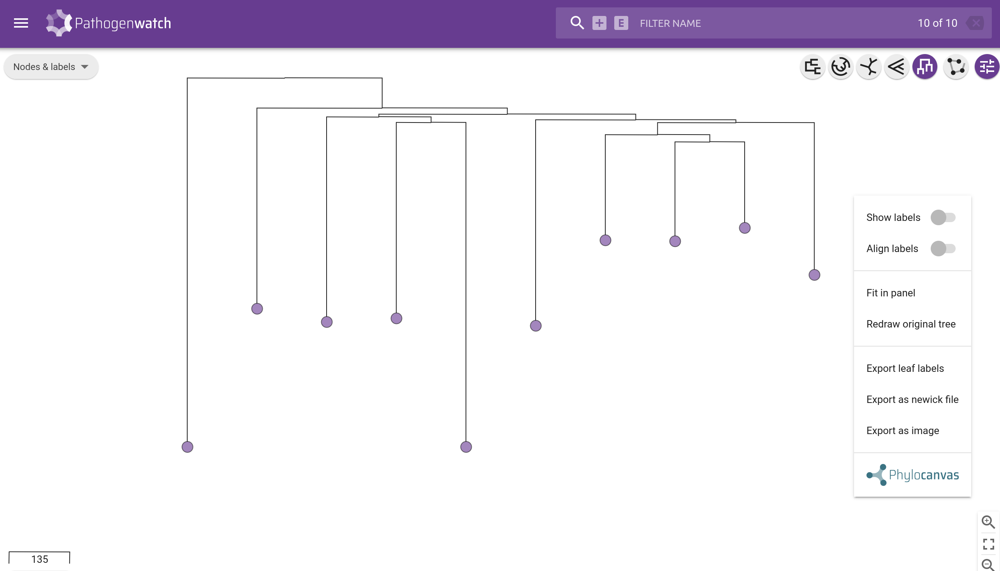
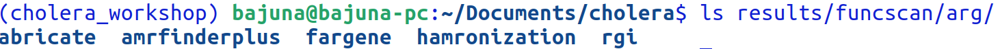

::: {.callout-tip}
#### Objectives

This section demonstrates a start-to-finish genomic surveillance analysis of a cultured dataset taken from cholera patients using the commands and tools covered in previous sections. The data can be downloaded in the link provided below:

By the end of this section, you should be able to:

- Using bioinformatics approaches to perform data quality check and filtering for genomics surveillance.
- Using command line to prepare sample data files, create environments, and manipulate files (directories/folders,etc) for analysis.
- Performing genome assembly for your isolates using epi2me-labs/wf-bacterial-genomes pipeline.
- Performing quality checks of the assembled genomes of your isolates. In this case you will be able to assess diffrerent levels (in the percentages) of completeness of your assembled genomes isolates using BUSCO. determine the completeness and contamination of your assembled isolates using ChecM, and provide a detailed screening of what kind of likely contamination your assembled genome isolates contained.
- Identifying possible antimicrobial resistance genes in your genome assembled isolates.
- Identifying or predicting sequence typing from your assembled isolates.
- Downloading available public reference genomes from public databases.
- Performing phylogenetic analysis to identify closely related pathogenic strains with your assembled genomes.
:::

We will analyse the data that was sequenced on Oxford Nanopore Technology (ONT) platform. The full data for this case study originally contained 94 samples with barcodes numbered from 01 - 94. However, only 10 samples (barcode25 - barcode34) had a substantial number of sequenced reads for this kind of genomic analysis.

The ultimate goal of the analysis is to create a single unified report which hopefully can be used by public health officials for an informed public healthy decisions including policy recommendations.

The report is expected to address the following important public health questions:

- Is there any Vibrio cholerae strain in the collected and sequenced samples?
- If the answer is yes, then is it a known pathogenic strain or unknown?
- If the answer is known, then does it known to be likely resistant to any antibiotics?
- If the answer is yes, then what kind of antibiotics resistant genes may contain and which antibiotics is predicted to be affected?

In addition, it is important to include and address in the report the underlying quality issues of your sequence data such as the quality of your reads and the assembled genomes, the different tools (with their versions) and their key parameters that was used to run the entire analysis for possible reproducibility of the analysis.

## Pipeline Overview
Our analysis starts with **FASTQ** compressed files **(.fastq.gz)** downloaded from the link above. We assume you have already created your directory where these raw data are going to be stored. The FASTQ files are also assumed to have been filtered and removed low quality reads, adapter trimmed during basecalling process by guppy. You can optionally look at the quality of your reads on your files before you start this analysis by using [FastQC](https://github.com/s-andrews/FastQC) tool. The FASTQ files are the main inputs to **[epi2me-labs/wf-bacterial-genomics](https://github.com/epi2me-labs/wf-bacterial-genomes) [nextflow](https://www.nextflow.io/) pipeline** to start your analysis. The primary output from this pipeline is an assembled genomes of your sampled isolates in compressed **FASTA (fasta.gz )** format, in addition to other secondary files such as **variants** and **genome annotation** files in **vcf.gz** and **.gff** formats respectively and a bunch of other files which can be used later for downstream analysis.

The next step of the analysis is to check the quality of the assembled genomes of your isolates. The two most important criteria to be used to accomplish this process are *completeness* and *contamination*. The completeness tries to find if all genes of the Vibrio cholerae have been recovered by the assembler whereas the contamination tries to check whether there other possible contaminants in your sequences apart from the expected Vibrio cholerae. The completeness is primarily performed by **BUSCO** which shows different levels of completeness of the assembled genomes. **CheckM** tool will also gives statistics of completeness and contamination. **Mash** tool is used for further helping providing much more detailed description and interpretation of the contamination results from CheckM.

After looking at the quality of the assembled genomes and we are satisfied with their quality, the next step of the analysis is to take the FASTA files and upload them in the **[Pathogenwatch](https://pathogen.watch/)** web pipeline for downstream analysis. Pathogenwatch will be essentially used to determine the typing of our strains, their lineages to see if their are evolutionary related to previous pathogenic strains, as well as if they potentially contain antibiotics resistance genes. The objective is to address the fundamental above questions in the report with regard to cholera.

Finally our analysis will finish with the detailed report which is aimed to be used by public health individuals as a guide to potential public health actions or policy changes. When you write this report, ideally you will be pulling information from the intermediate outputs of different tools that are in CSV/TSV/json file formats. For instance, the contents of this report will contain information about the quality of assemblies, coverage statistics, variants, predicted lineages and sequence typing (ST) and antimicrobial resistance genes (AMR) related to your isolates.

Therefore, our analysis will have the following sections:-

- Initial quality checks of the sample reads from the isolates
- File preparations.
- Genome assembly of the sample reads
- Quality check of the assemblies which will look at:-
    + Screening for contamination which will examine if there are any other strains in our samples apart from the Vibrio cholerae and at what level.
    + Reads coverage.
    + Completeness of the assemblies which ensures that the assembly for each isolate genome contains almost all expected genes of the V.cholerae.
- Finding possible antimicrobial resistance genes from the assembled isolates genomes.
- Identify possible strain typings of the isolates genomes and how close or likely they are evolutionary related with known pathogenic 7PET lineages. This can be further achieved using phylogenetic tree either by using pathogenwatch or other tools. We will use pathogenwatch.
- Generate report.

{#fig-pipeline-workflow}

## Setting up Directories and Preparing files
For convenience and desired reproducibility of the analysis, it is a good standard to set up the important directory/sub-directories and prepare necessary files which will be required to run your analysis. We will be using what we have learned from the Unix commands to accomplish this task. We will start by creating:

- a single directory named 'cholera' inside the preferred `/home/<your_username>/Documents/` directory which will be storing data, scripts, results, reports and other important resources for our analysis. You will have to change 'your_username' to the one that appears in your screen of your terminal when typing the command `echo $USER`.
Inside this 'cholera' directory we will be creating other directories or folders namely:
    + data - for storing raw data (fastq files) and other database files
    + scripts - for storing all scripts for running analysis at different stages
    + results - for storing results of the pipeline
    + reports - for storing reports
    + reference_genomes - for storing Vibrio cholerae reference genomes.

You can create directories by typing in the terminal the command `mkdir` followed by the `<directory_name>`. 

Example in our case, we start by moving into the `/home/<your_username>/Documents/` directory by typing `cd /home/<your_username>/Documents/` or simply `cd Documents`. And then type `mkdir cholera` to create 'cholera' directory.

### Data
Our bioinformatics analysis will start by first viewing the FASTQ files generated by basecalling software called Guppy. The software normally generates the files and put them into the directory named **fatq_pass**, which contains other subdirectories for each sample barcode. To view the files we will firstly need to be inside our 'cholera' working directory by typing the following command, `cd cholera`.

Then we use the command 'ls' to view the raw data - `ls data/fastq_pass`. Your output will be looking similar like the one below screenshot:

{#fig-view-raw_fastq}

### Metadata
Having metadata (data about our raw FASTQ files) is important in order to get clear understanding on how the samples / raw data were generated. Information like sample names or ID, date of collection, the location where they were collected, sequencing platform used, protocol, etc. are important to be stored in spreadsheet file and savwed with TSV or CSV format. In addition, the metadata is extremely useful for downstream analysis, further interpretation of the results and reporting.

## Quality of the reads
For the sake of the cholera genomic surveillance analysis, our major quality check of the sample reads is to check if each of them containing largely the V.cholerae genomic sequences.

### Containment of the nanopore reads
We use mash software within our workflow to assess the containment of our nanopore reads in which we want to know whether there are other things/species unrelated to V.cholerea in our samples or even understanding if each sample isolate is really V.cholerae at all.

The following shell scripts run the mash tool. The code will start to create the result folder for the mash and run through each genome assembly isolate the screening for containment. And then it will sort the result in ascending order starting with the species with the high percentage of reads in the assembly and store the results in sorted tsv file format instead of the defualt .tab format given by `mash screen` command which is removed by the same shell script.

::: {.callout-important}
You must download the most updated mash database version from [the mash website](https://gembox.cbcb.umd.edu/mash/refseq.genomes%2Bplasmid.k21s1000.msh)

```md
mkdir -p reference_genomes/mash_database # create subdirectory for mash database
cd reference_genomes/mash_database # move inside mash data base folder from your default 'cholera' directory
wget https://gembox.cbcb.umd.edu/mash/refseq.genomes%2Bplasmid.k21s1000.msh # Download the file using wget command
cd - # Return to 'cholera' working directory
```
:::

```md
#!/bin/bash

mkdir results/mash/

for file in data/fastq_pass/clean/*.fastq.gz
do
    mash screen reference_genomes/mash/refseq.genomes+plasmid.k21s1000.msh $file -w -p 4 > results/mash/$(basename $file .fastq.gz)_screen.tab
    sort -gr results/mash/$(basename $file .fastq.gz)_screen.tab > results/mash/$(basename $file .fastq.gz)_screen_sorted.tsv
    sed -i '1i \identity        shared-hashes   median-multiplicity     p-value query-ID        query-comment' results/mash/$(basename $file .fastq.gz)_screen_sorted.tsv
done
rm results/mash/*_screen.tab

```
The winner-take-all strategy (-w) parameter removes much of the redundancy for easy interpreting the results and -p parameter can be used to add more cores to run mash much faster. The sed command add columns headers to each output file generated by mash.

Typing in your terminal the command `ls results/mash` will list the mash result per sample barcode as shown in the screenshot below:

{#fig-mash-result-files}

There are different ways to view the above results from mash. The easiest but very unpleasant way for Windows user is to use commands less, more or cat Unix commands inside WSL2 or Ubuntu VM you use for this workshop. For instance, the command `less results/mash/barcode25_screen_sorted.tsv` will show the percentage of the containment per sample reads for the sample with barcode25. See Figure below.

{#fig-mash-result-barcode25}

You can also view this file using Google sheet or any spreadsheet software for instance MS Excel from your computer.

If you look at the results above for the barcode25, you can see the expected V.cholera with the highest percentage identity. The columns in that tsv file are in the following order [identity, shared-hashes, median-multiplicity, p-value, query-ID, query-comment]. Our reads for barcode25 appear to be significantly related to several V.cholerae pathogenic strains (O1) genome assemblies. And this may initially answer two critical questions with regards to cholera genomic surveillance which are:

- Is this V.cholerae?
- Is this pathogenic strain?

The second question may be confirmed during downstream analyses.

## Genome Assembly
The first step in our bioinformatics analysis is to run `epi2me-labs/wf-bacterial-genomes`. To do this we will start by preparing the required input files in a single file called **samplesheet** which should is in the **CSV** format.

### Samplesheet
For Nanopore data, we need to create a samplesheet CSV file describing about the samples you would like to analyse before running the `epi2me-labs/wf-bacterial-genomes` pipeline. 

The samplesheet file will have two major information; 'barcode' and 'alias' columns. The 'barcode' describes barcode names of the samples, which acts as an identifier attributed to the individual sample during multiplexing. For instance barcode01, barcode02, barcode03, barcode34, etc. The 'alias' column provides generic description or custom sample name for each barcode.

You can produce this file using Excel or Google sheet.

Using `less` or `more` commands we can view the contents of this file as shown below:

`less sample_sheet.csv`

{#fig-view-sample_sheet}

### Running epi2me-labs/wf-bacterial-genomes
We will now start our analysis by running epi2me-labs/wf-bacterial-genomes pipeline which does genome assemblies of the isolates sequence reads. Make sure that you are inside the 'cholera' directory which contains 'data', 'scripts', 'reference_genomes' and other directories. The pipeline is intended to be running using reference guided assembly mode instead of de novo assembly. Therefore, we will need to download the reference genomes before running pipeline.

There are about 17 V.Cholerae well established reference genomes of which 14 belong to current pandemic (7PET) lineages. Each of these are shortened with 'Wi_Tj' where 'W' stands for a **Wave** and 'i' is its number, and 'T' stands for **Transmission** event and 'j' its number. For instance, W1_T1 reference strain means "wave one transmission one". Out of the 14 strains only one lineage does not follow this nomenclature which is "7PET_MiddleEastern". For the sake of this analysis we will download the most recent pandemic reference genome of the 7PET V.cholerae strain related to W3_T13 from the NCBI with its annotation gff file. This strain has been associated with the recent cholera outbreak in Yemen. This can be downloaded here (https://www.ncbi.nlm.nih.gov/datasets/genome/GCF_937000105.1/).

### Downloading reference genome
There are different ways which you can download reference genomes. One of the easiest way is that, you can copy the link provided above to the address bar of your favourite browser preferably Google Chrome and then press enter. See the image below:


You will see the page like the one in the below image showing the information about the genome assembly of this strain. The assembly is complete with 99.69% of the genome recovered.


In that genome assembly page, you will see the "Download" button. When you click that button, the pop-up window will be displayed as illustrated in the image below.


Select by ticking the 'Genome sequences (FASTA)' and 'Annotation features (GFF)' formats. You can rename the file accordingly. Finally, click the 'Download' button to download the reference genome assembly.

By default, the reference assembly will be downloaded in the ~/Downloads directory in the 'zip' format. Use the following command to copy the zip file to `reference_genomes` directory that you created earlier. Suppose you are inside the `cholera` directory, and you want to copy the downloaded file, it is recommended that to create subdirectory inside 'reference_genomes' and naming it for instance 'vibriocholerae' or any relevant descriptive name before you copy the zipped reference genome files. In your terminal window type the following codes which will first create a subdirectory and copy the files from `~/Downloads folder.

```md
mkdir -p reference_genomes/vibriocholerae
cp ~/Downloads/ncbi-dataset.zip reference_genomes/vibriocholerae/
rm ~/Downloads/ncbi_dataset.zip
unzip reference_genomes/vibriocholerae/ncbi_dataset.zip -d reference_genomes/vibriocholerae/

```
Now, if you list the files in the subdirectory 'reference_genomes/vibriocholerae' using the command `ls reference_genomes/vibriocholerae` you will likely see another subdirectory 'ncbi_dataset' with its associated 'ncbi_dataset.zip' file and 'README.md' file. You can remove the 'ncbi_dataset.zip' by typing `rm reference_genomes/vibriocholerae/ncbi_dataset.zip` to regain the disk space taken by the file. The accompanied 'README.md' file describes about the content of the downloaded files. 

Exploring further the subdirectory 'ncbi_dataset' you find another subdirectory named 'data'. By typing `ls reference_genomes/vibriocholerae/ncbi_dataset/data` you will find many files and other subdirectories which contains the reference genomes files we want to use for the genome assembly task of our sample reads isolates. There are two most important folders named 'GCF_937000105.1' and 'GCA_937000105.1'. The 'GCF_' contains Refseq files while 'GCA_'  contains the Genbank files. You can type `ls reference_genomes/vibriocholerae/ncbi_dataset/data/GCF_937000105.1` and `ls reference_genomes/vibriocholerae/ncbi_dataset/data/GCA_937000105.1` to view the contents of both folders. 

The files in both folders are basically the same. We will use the refseq ones. You can copy the files inside the 'GCF_$' folder into 'reference_genomes/vibriocholerae/' directory to make the path shorter. And remove the rest of the unzipped folder to clear the disk space as shown in the code below:

```md
cp reference_genomes/vibriocholerae/ncbi_dataset/data/GCF_937000105.1/GCF_937000105.1_CNRVC190243_genomic.fna reference_genomes/vibriocholerae
cp reference_genomes/vibriocholerae/ncbi_dataset/data/GCF_937000105.1/genomic.gff reference_genomes/vibriocholerae/GCF_937000105.1_CNRVC190243_genomic.gff
rm -r reference_genomes/vibriocholerae/ncbi_dataset

```
Now we are ready to run the epi2me-labs/wf-bacterial-genomes pipeline. Before running the pipeline, we need to create the folder where the output of the pipeline will stored. We will create this directory inside the folder 'results' which we created earlier and we will name it as 'wf-bacterial-genomes'. This is all done within the same shell script file which is used to run the pipeline as shown below.

```md
#!/bin/bash

mkdir -p results/wf-bacterial-genomes

nextflow run epi2me-labs/wf-bacterial-genomes -profile singularity \
--sample_sheet sample_sheet.csv \
--fastq data/fastq_pass \
--reference 'reference_genomes/vibriocholerae/GCF_937000105.1_CNRVC190243_genomic.fna' \
--threads 4 \
--out_dir 'results/wf-bacterial-genomes' \
--reference_based_assembly True \
--isolates True 

```
When choosing the nextflow profile to use, you can optionally choose 'singularity' which in most cases particularly in Ubuntu set up works fine or otherwise you can leave this option and let the pipeline choose for you in which case the default profile will be docker. So make sure docker has been set up and running in your system. You can further add `--basecaller_cfg` parameter in the shell file above if you know which model used to basecall the raw reads. Type `ls results/wf-bacterial-genomes` from your 'cholera' working directory to view the generated primary outputs of the pipeline.

If eveerything went well, it will approximately take an hour depedning on you PC specs and number of threads (cpu) you have given the pipeline to process the data. i.e. `--threads` parameter, which in our case we have given 4 CPUs. 

The primary outputs of the pipeline include:

- a FASTA consensus sequence scaffolded from a provided reference sequence, this is compressed (with .gz file format),
- a VCF file containing variants in the sample compared to the reference, this is also compressed (with .gz file format),
- an HTML report document detailing QC metrics and the primary findings of the workflow,
- a gff file which is optional containing annotation of the consensus sequence using prokka.
- a tsv file per-sample containing AMR output directory with various results.
- a json file with typing results per sample using mlst.

The main files which we will further analyse in the downstream are FASTA (genome assemblies for each isolate), tsv and typing (.mlst.json) files. We will start with (.fasta.gz) assembly files by assessing their qualities.

The compressed FASTA (.fasta.gz) file however needs to be decompressed as there some of the tools used in the downstream analysis work with only decompressed assembly files, i.e. '.fasta' format. The following coomand will decompress the generated fasta files into .fasta format.

```md
gunzip results/wf-bacterial-genomes/*.fasta.gz

```

## Assesing quality of assembled genomes
There are different dimensions or criteria to use for assessing how accurate are assembled genomes or if they are truly representative of the sampled isolates. There are various factors that may arise during the entire process of collecting samples to sequencing which could affect the resulted assembled genomes. This might include biological and technical contamination among other things. Therefore, before we proceed with any downstream analysis we need to assess the quality of the assembled genomes. We will be looking at the following criteria in assessing the quality of our assembled genomes isolates:

- Contamination - we want determine if there are possible contamination that might have occurred, for instance during sample collection.
- Completeness - we want to check if the assembled genomes are really representatives of the Vibrio cholerae genes.

We achieve both assessments by using BUSCO and checkM tools which are part of our workflow illustrated in the Figure 6.1 above. Both provide scores for each sample to asses the completeness of the assembled genomes in addition to contamination scores. To have more confidence of the qualoty of our genomes we decided to run both of them. Essentially checkM is more of prokaryotic specific while BUSCO supports all and it is also stringent in determining completeness. With MultiQC support for BUSCO it further becomes handy in visualising the results as we will see shortly.

The detailed screening of the samples to find what possible contamination might be in the sample was done by mash software above.

The following shell scripts run the BUSCO and checkM respectively. In the BUSCO shell script we can further use a MultiQC software to create an HTML report to easily visualise the BUSCO results. 

```md
#!/bin/bash

mkdir -p results/busco

for file in results/wf-bacterial-genomes/new/barcode*.medaka.fasta
do 
    busco -m genome -i $file -f -o results/busco/$(basename $file .medaka.fasta) --auto-lineage-prok
done

# Run multiqc for busco results
cd results/busco/
multiqc .
cd - # move back to the cholera working directory
```
For checkM we need first to set up a database. We download the database online. All this is done through the same shell scripts below

```md
# Setting up databases for checkM
#
 mkdir -p data/checkM_databases
 cd data/checkM_databases
 wget https://data.ace.uq.edu.au/public/CheckM_databases/checkm_data_2015_01_16.tar.gz
 tar xfz checkm_data_2015_01_16.tar.gz
 checkm data setRoot $(pwd)

 mkdir -p results/checkm

# Use -x to specify the format of input fasta files. By default it looks for .fna formats in the directory

checkm lineage_wf results/wf-bacterial-genomes/ results/checkm --tab_table -t 8 -x fasta --reduced_tree > results/checkm/samples_completeness.tsv

```

From your terminal open the BUSCO results by moving into the folder `results/busco` using `cd` command as shown above in the shell script. Use you browser to open the multiqc html file. You can use command line or Graphical User Ingterface (GUI) to do that. With command line just type the following command in your terminal:

```md
firefox multiqc_report.html
```
With GUI you need to open file explorer by clicking 'Files' in the [gnome dash](https://askubuntu.com/questions/1126811/what-are-the-elements-of-the-gnome-desktop) on your desktop. A similar window like the one in the image below will appear.

{#fig-file-explorer}

Click on the Documents directory and you will see the cholera folder which you created earlier. See the image below:

{#fig-file-explorer-cholera-dir}

Click 'cholera' directory and then click results followed by busco subdirectories then you will see a multiqc_report.html file. See the image below.

{#fig-file-explorer-cholera-results-busco-dir-multiqc_report}

Right click and open with your default browser.

Now, if you look at the MultiQC report of the busco results you will see two major plots showing completeness of the genes in our genome assemblies based on the generic orthologs database of bateria and specific orthologs database of Vibrio bacteria. We observed that for our sampled barcodes all of them have significantly high completeness score. The plots will be looking similar to the two images below:

{#fig-bacteria-results-busco-dir-multiqc_report}

{#fig-vibrio-results-busco-dir-multiqc_report}

We are more interested in the completeness of the genes (green bars) which show the highest percentage of scores for each assembled sampled barcode isolates and therefore we can have certain confidence in the quality of our assembled genomes. The red bars may give us further indication of the existence of other unrelated genes or contamination which we observed earlier using mash but also can be quantitatively further obtained using checkM as shown in the table below. Unfortunately, we cannot use MultiQC to visualise the checkM results, instead we are going to use previous approach of spreadsheet software to view the results as we did with mash in the earlier quality assessment of the sampled reads when we were checking possible contamination. We can regard this contamination check with checkM as confirmation check for contamination. To have a clear and nice view of the table you need to delete upper rows up to the row just before the 'Bin Id' and other column headers start which should be kept. You may need also to delete the last row as well. Once you do that, you will have a similar look of the results as shown in the image below when you open the checkM results using your favourite spreadsheet software.

{#fig-vibrio-results-busco-dir-multiqc_report}
  
The interesting columns are 'Completeness'  and 'Contamination' which overwhelmingly show the confidence in the completeness of our assembled genome isolates and very low contamination. The completeness of the genome can be translated by looking at the total number of marker genes in the '# markers' column, and how many times certain number of the marker genes appear in the single-copy genes in the reference genomes trees when looking at the columns labeled 0, 1, 2, 3, 4, 5+ which represent zero, once, twice, etc, respectively. So for instance, for barcode25 we have total of 1130 marker genes of which 1092 appear once and hence they determine number of completeness, 3 appear twice while 35 genes do not appear at all, i.e. are missing. This can be further interpreted as follows: *the more missing genes the less completeness. The more genes appear more than once the more contamination in the genome isolates*.

Therefore, by looking at both BUSCO and checkM results we are highly confident of the quality our assembled genomes which was also reflected by **mash** results for the quality of **fastq** reads files for each of the sampled barcodes. We also know that the assembled genome isolates are from Vibrio cholerae. In addition, based on the early **mash** results there is an indication that some of our sampled isolates may be correlated with some of the known Pathogenic pandemic V.cholerae strains. We may confirm this in the next stages of downstream analysis using Multlocus Sequence Typing (MLST) and phylogenic approach.

## Multilocus Sequence Typing (MLST) with Pathogenwatch
MLST has become a gold standard technique for identification and characterisation of the bacterial isolates in many public health laboratories as mean of epidemiological analysis and pathogen surveillance. The aim of MLST in the outbreak scenario is to identify the pathogen strain type of the sampled isolates using sequence data. This may help to detect changes in the nucleotide sequence which cannot be detected using traditional ways that are based on the serotyping. During the outbreaks the public health laboratories use MLST to inform and help officials in understanding and managing disease outbreaks.

Current MLST approaches are based on sequence analysis of selected housekeeping genes related to particular (pathogenic) bacteria of interest and has become the method of choice for determining the global epidemiology of pandemic bacterial pathogens. For determining if some of our sampled isolates are likely to be pathogenic strains, we use sequence typing technique based on the known seven housekeeping genes in V.cholerae (i.e. adk, gyrB, metE, mdh, pntA, purM, and pyrC) with Pathogenwatch web-based tool which relies on PubMLST database in addition to phylogenic technique. Based on this approach we want to determine which pandemic strain types are dominant in our sampled isolates or whether we have potential novel strain types at all.

The first step is to download selected public available complete whole genomes of V.cholerae from NCBI which are pandemic strains but also for control we download non-pandemic strains (with known sequence typing in both cases). We download two files for each genome; one with contigs FASTA sequences and other one is annotated genome sequences GFF as described above.

### Uploading FASTA files into Pathogenwatch
Perform the following step to upload the FASTA files in the Pathogenwatch:

- Go to the Pathogenwatch web portal by clicking [here](https://pathogen.watch/){target="_blank"}. In the page you will see **Upload** link in the top right corner of the page as shown in the image below:

{#fig-vibrio-watch-upload}

Before uploading files to Pathogenwatch you need to create an account. You can easily do that using your Google account. If you don't have it you can use your Twitter or Facebook accounts or your email address in which a link will be sent to your email for verification. Once signed in then click the link and you will be directed to the **Upload** page as shown in the image below:

{#fig-vibrio-watch-upload_fasta}

Click in the "Upload FASTA(s)" Single Genome FASTAs option which is pointed by a red arrow. 

The new page as shown in the diagram below which will enable you to upload your single FASTA file (assembled genomes of your isolates) by drag and drop from you computer will pop up. In the **Settings** check both options (two red arrows) if the Internet connection is slow and unstable. 

{#fig-vibrio-watch-upload_fasta_second}

Then you can upload each file by clicking on the "+" sign (red circle). You cannot upload FASTQ files as the Pathogenwatch does not support yet analysis of data generated from ONT directly. A window like the one shown in the image below will appear which will allow you to select the files from your local machine provided. You need to double click `Documents` -> `cholera` -> `results` -> `wf-bacterial-genomes` folders within the pop-up window to find the FASTA files. Instead of uploading each file one by one which will take a valuable amount of your time, you can upload all at once by clicking and selecting all of your FASTA files while holding 'Ctrl' keyboard. Click open on the dialogue window after you have selected all of your FASTA files.

{#fig-vibrio-watch-upload_fasta_all_selected}

If you have metadata file associated with your samples you can download them as well. Make sure all metadata files are in **CSV** format with recommended five columns which are 'latitude', 'longitude', 'year', 'month', and 'day'. You can also use the template provided to prepare your metadata files.

Once you uploaded your FASTA files and metadata files for each of your sampled barcodes, a new page showing samples being uploaded and processed will be seen and eventually all samples will be finished uploaded and processed as it is shown in the below image.

{#fig-vibrio-watch-uploaded_fasta_all_selected_processed}

Pathogenwatch performs the following major analyses with regards to the genomic surveillance; AMR, Sequence Typing (ST) which uses two methods tradional MLST and core-genome MLST (cgMLST), and provides General Stats.

::: {.callout-note}
For further reading on the typing methods used by Pathogenwatch read [here](https://cgps.gitbook.io/pathogenwatch/technical-descriptions/typing-methods){target="_blank"}

:::

Click in the **VIEW GENOMES** to see the detail analysis of each uploaded genome. The page like the one in the below image will be shown:

{#fig-vibrio-watch-results_page}

If you look at the image above (Figure 6.2) you will see a tabular structure of the results listing the uploaded images. Useful columns for your analysis are indicatedd using red arrows pointing downward to each column. Other useful information or links are red-circled. There are 10 genomes uploaded out of the 318,798 genomes of all species. The first column (`Name`) shows the names of the uploaded samples, the second column (`Organism`) shows the name a species name of the organism of our interest in this case Vibrio.cholerae, the third column shows the Type in which each of the uploaded genome has been assigned based on the MLST/cgMLST methods/schemes, the fourth column shows the Typing scheme used to assign typing in this case is 'MLST', the fifth column (`Country`) shows the country where the sample associated with the genome was collected, the fifth column (`Date`) shows the date in which the sample associated with the genome was collected and the last column (`Access`) shows the access mode of the genome file, that is whether it is public or private in this case it is private and not yet published for sharing with wider global community. The `Selected Genomes` button shows the number of genomes that have been selected from your table in your left side for further downstream analysis. The number will only appear if you have checked (ticked) the `Name` column at the top.

The next is to check (tick) in the `Name` field and select all of the uploaded genomes. We the click the `Selected Genomes` button to do the following:-

- creating collection with its descriptive name
- automatically create reports for this collection
- dowlnload the analysis report for this collection
- perform phylogenetic analysis and generate tree for this collection

After checking you will see the similar image like the one below.

{#fig-vibrio-watch-collection_page}

After clicking `Create Collection` button another pop-up will appear as shown in the diagram below which will require you to write a detailed description of your collection. 

{#fig-vibrio-watch-creating_a_collection_page}

It is highly recommended to provide detail of your project. For instance:-

 - Title of project - Example, "Cholera nanopore samples collection for genomics surveillance"
 - Description of your project in the textbox provided - Example, "These are assembled genomes isolates from nanopore samples collected from cholera patients after the outbreak."
 - If your data come from the published study provide a DOI of the study (No DOI for this study)
 - Finally, click `Create now` button to create a saved description about your project. 

After clicking `Create now` button a Window similar to the image below will be displayed showing a table with the names of your barcoded samples and predicted typings (using MLST) with reference used to call the typing, in this case W3_T13. In addition, the profile for each genome isolate will be displayed.

{#fig-vibrio-watch-collection_analaysis_table}

The table contains several columns. The first and second columns allow you to downlad the assembled genome and annotation in its FASTA AND GFF formats respectively. The third column contains the names of the barcodes. The fourth column is the reference used to call typings which in this case belongs to 7PET pandemic strain (W3_T13). However, we do not have enough information about which exact reference pandemic strain's NCBI accession used to call typings for our samples. The fifth column is predicted sequence typing for each assembled genome isolate. All of these seem to be novels (*). Click  [here](https://cgps.gitbook.io/pathogenwatch/technical-descriptions/typing-methods/mlst) for further information on how Pathogenwatch uses MLST method for prediction of typing. The sixth column is 'PROFILE' which provides the individual loci codes.

### Phylogenetics and identification of sequence type (ST)

When you click the button view tree, Pathogenwatch will automatically generate an unannotated phylogenetic tree like the one showed in the diagram in Figure.. showing the evolutionary relationship between different assembled genome isolates. To be able to annotate the tree you have to right click within the tree and a pop up window will show up aside the tree as shown in the same image which allows you to anonotate tree for instance by showing or aligning labels in which you need to click in the options to activate to be able to do the tasks. "Show labels" will show the barcode names/sample names associated with each tree node. You can also change the topology of the tree from the top right of the left frame.

{#fig-pathogenwatch-tree_samples_only}

We will start annotating this tree by showing labels, which will show the phylogentic relatedness of the assembled genomes isolates as shown below:

{#fig-pathogenwatch-tree-activated-labels}

We can further play around with a tree by changing the tree annotation by clicking accordingly on the column headers of the table shown in the Figure 6.5 above. For instance, we can click on the **Reference** header to see the phylogenetically closely related reference strains, which in this case will only show just one strain (W3_T13) for all assembled barcodes as they use single strain which is a recent 7PET one as shown in the image below.

{#fig-pathogenwatch-phylogenetic-tree-reference-strains}

The same way we can visualise tree based on the **ST** (sequence typing) header to show the phylogenetic relationship of the identified sequence typings, in this case all seems to be unusually novel (*).

{#fig-pathogenwatch-phylogenetic-tree-typings}

The above phylogenetics trees in Figures 6.8 and 6.9 do not give any information which would help us to determine the likely lineages or typing of any of our assembled genomes isolates with the known pathogenic strains or type as the tree is generated only based on aligning the annotated genome isolates with the single reference which was done automatically by Pathogenwatch. 

Therefore, we need to download considerable number of the recently identified different reference genomes of the known strains from the NCBI database. That is the first step. Then uploading these genomes into the Pathogenwatch as the second step. Afterward, combining these with the collection of our assembled genomes that we created earlier in the Pathogenwatch as the third step. And lastly generate tree using Pathogenwatch to view how our samples co-cluster with the known strains.

We maybe able to download recent publicly genomes of the assembled V.cholerae from this [NCBI website](https://www.ncbi.nlm.nih.gov/datasets/genome/?taxon=666) in you may have access to all publicly known assembled genomes strains of the V.cholerae from 1980 - to date (2023) which are estimated to be 5,958. However, we can filter how many of these we need to download from within the website. The filter would be based on which genomes from which dates, reference genome only, annotated genomes, or assembly levels of the strains as shown in the image below.

{#fig-downloading-filtering-vibrio-genomes-ncbi}

In our case, we may need to download only the very recent genomes from 2019-2023 as these are handful for easy visualisation in the pathogenwatch. So the filtering criteria would be "Annotated genomes", "Annotated by NCBI RefSeq" "Exclude atypical genomes", "ASSEMBLY LEVEL" should be complete (drag the slider to complete), and "YEAR RELEASED" should be dragged to 2019-2023. The selected filter is shown in the image below. Also, rember to tick the checkbox in the "Assembly" column header to activate "Download" button.

{#fig-filtering-ncbi-genomes-to-download}

Based on these filters we are expecting to download a total of 63 public available genomes to our machines. So clicking the "Download" button, you may see two download options which are "Download table" and "Download package". The "Download package" gives you ability to download actual filtered genomes (in FASTA) with their annotation files (in GFF) as well as the associated metadata in a single zipped file. The "Download table" option will only download the metadata information for the genomes. Click "Download package".

{#fig-ncbi-download-Download-options}

When we click "Download package" a list of options for downloading genomic data will be shown. Select "Refseq only (63)" then tick two checkboxes "Genome sequences (FASTA)" and "Annotation features (GFF)". Then click download. Rename the "ncbi_dataset.zip" as "ncbi_vcholerae_63_genomes_dataset.zip".

{#fig-ncbi-download-genomes-package-options}

The next thing is to extract the downloaded zip folder. You can easily do that GUI or command line. Once you extract the zip files you will likely see the files are in the folder "data". Using terminal or GUI go to inside that folder. Now you need to use a Unix command to copy all files into a single folder for easy upload in the Pathogenwatch. From the terminal type `cd ~/Downloads/ncbi_vcholerae_63_genomes_dataset/ncbi_dataset/data` command. Then type the command `mkdir 63_concatenated_genomes` to create a single folder inside that directory in which we can copy to our downloaded genomes. Then use the command `cp *GCF_*/*.fna 63_concatenated_genomes/` to copy all files into that new folder.

Let us stay in the same directory and look at another important file named "**data_summary.tsv**". This is actual metadata file which we also neeed to upload into the pathogenwatch for phylogenetic as well. Use any spreadsheet software to open the file. The file looks like the one below in the Figure ..

{#fig-Screenshot-metadata-downloaded-genomes}

The table in that file has many columns. For the sake of this training, the most important ones seem to be "**Organism Scientific Name**", "**Organism Qualifier**" and "**Gene Count**". The first column gives information about whether the genome is in pathogenic or not i.e. known 7PET, the "Organism Qualifier" column tells us about the assigned strain name, and "Gene Count" gives number of genes for each genome. The latter may give us more confidence on the quality of assembled genomes isolates if you compare with the BUSCO or checkM results that we discussed earlier.

The next step is to upload all these genomes files into the pathogenwatch by following the same steps we discussed in the section 6.6.1. These files are in `.fna` format which is one of the formats that are accepted by the pathogenwatch. Afterwards, you need to create a collection for these genomes and later combining them with "Cholera nanopore samples collection" which we created earlier OR we combine these files together with the collection we have already created. We will do the latter option. Once we download the genomes, you can view all genomes after being analysis or you can click to genomes menu option at the top of the website. You will see the table like the shown oin the screenshot below:

{#fig-Screenshot-pathogenwatch-uploaded-public-genomes}

You will see the recently uploaded genomes are shown to be at the top of our sampled genomes and are unchecked while our sampled genomes are checked down below the uploaded genomes. See the red marked columns.

### Exercise

::: {.callout-exercise}


Examine the red-marked column "Type". Determine the predicted novel sequence types of the public V.cholerae genomes.

:::

Now you need to check all public uploaded unchecked genomes which seen to be private in the pathogenwatch as indicated in the red-marked last column. Once you checked them, the total number of previous created collection will be 73 instead of 10 after we have added additional 63 genomes. Then create a new collwction named it accordingly as discussed earlier. You may name this collection as "Additional genomes for phylogenetics and typing identification". Then click "CREATE NOW" button.

You need to wait for a bit of seconds while pathogenwatch is genereting a new tree. Meanwhile you can sroll down the table to observe the information about our genomes and those new ones we upload from NCBI. Two columns are of particular interest to examine. These are "REFERENCE" and "ST". No changes in our sample genomes, but you may observe changes with the newly uploaded genomes from NCBI.

### Exercise

::: {.callout-exercise}


Discuss with your colleague what kind of information you can extract from the two columns (**REFERENCE** AND **ST**) with regard to the new uploaded genomes from the NCBI.

:::

When you click view tree you will see the unlabeled tree displayed. We want to label our tree based on the names of the genomes (default), reference strains, and sequence typing (ST). Point your mouse to the frame where the tree is displayed and right click and enable show labels to view the tree with genome names. See the images below which shows the tree in genome names, reference, and sequence typing respectively:

{#fig-pathogenwatch-phylo-tree-name}

{#fig-pathogenwatch-phylo-tree-ref}

{#fig-pathogenwatch-phylo-tree}

However the tree doesn't seem to be clearly visualised. Therefore, we need to export the tree to be able to view it in any other open tree viewing software tools that are available to see whether we can have any useful context from the tree with regard to the identification of lineages of our 10 samples and to have a certain confidence on presence of pandemic associated strain(s) in the samples. 

Exporting tree from pathogenwatch is easy. You just right-click inside the frame where the tree is displayed and the pop up window which you see when you label the tree contains an option ("Export as newick file") to export tree in `.nwk` format. Automatically when you export the tree the newick file will be downloaded in the `Downloads` folder. We will export three files to be able to view it in genome names, reference and sequence typing, but each time you export, the file will have the same default name given by the pathogen watch. So, we need to rename the file in a meaningful way for easy interpretation.

There are couple of open software tools that are used for viewing phylogenetic tree. At this time we are choosing a web based tool dedicated to generate tree from newick file format known as [ETEToolkit](http://etetoolkit.org/treeview/).

{#fig-etetoolkit-treeview}

Click "Browse..." button just down below a text label saying "Paste your tree in newick format:". Upload each of the three newick files that we have exported from the Pathogenwatch. And each time when you upload the file make sure you click "View tree". You will likely see the trees which look like the ones below.

{#fig-Tree-viewer-Online-visualization-of-phylogenetic-trees-newick-gnames}

{#fig-Tree-viewer-Online-visualization-phylogenetic-trees-ref}

{#fig-Tree-viewer-Online-visualization-phylogenetic-trees-st}

The three Figures above (Figure 6.20, 6.21, and 6.22) show how our samples clusters with the recently available downloaded public genomes with their associated reference strains and sequence typings (the red highlighted clades) in which one of the reference genome names was used earlier by epi2me-lab/wf-bacterial-genomics tool to generate assemblies for our isolates.

### Exercise


Read carefully the phylogenetic trees above in the Figures 6.20, 6.21, and 6.22 and answer the following questions:

- What is the name of the NCBI reference genome that was used by epi2me-lab/wf-bacterial-genomic pipeline.
- Which of the two reference genomes names closely related to our sample genomes have been recently shown to be associated with Cholera in Pakistan
    + What is the Biotype of this strain (Is it O1 or O139)?
    + What is drug resistance associated with this strain (refer section 6.7)?
    + What is the most recent publication (paper) associated with this strain?
    
  ::: {.callout-tip}
  Use the summary file that you downloaded from the NCBI with the 63 genomes to extract the name of this genome and its reference strain name.
  Once you extract this, use Pubmed database to answer the three questions that follow.
  
  You can discuss with your colleagues. This question may somehow depend on the Exercise 6.6.4
  
  :::

### Exercise


Based on the answers from the previous exercise 6.6.5, can you definitively conclude that our samples isolates are pathogenic of the 7PET OR what samples seem to be of 7PET based on the above phylogenetic analysis?

::: {.callout-tip}

To be categorised into the 7PET usually the isolates have to be in the Biotypes of O1 or O139, and closely related with the reference strain of W3_T13 and sequence typing (69). Our typings seem to be all novel (*) though. You need to discuss this with your colleagues as well.

:::

<!--The second step is to perform multiple sequence alignment between the public downloaded sequences and our genome assembled isolates. This step will be done automatically with Pathogenwatch but we will do it manually as well using MAFFT. 

The next step is to perform phylogenetic analysis which will be also automatically done by using Pathogenwatch. This can be also manually done by using IQ-TREE software. The two tools are aimed to be used for constructing the phylogenetic MLST tree

The last step is to visualise tree for aiming of observing if there are any cluster(s) formed between our sampled isolates and public sequences with known sequence typings with the interest of finding if there is any phylogenetic clade between our sampled strains and known pathogenic strains with known typings.-->

## Antimicrobial Resistance (AMR) analysis

According to [WHO](https://www.who.int/publications/i/item/9789241564748), antimicrobial resistance (AMR) has become a global public health issue in which a lot of pathogenic bacterial strains have become resistant to antimicrobial drugs. Therefore, for improving cholera disease surveillance we need also to determine AMR associated with V.cholerae. To achieve this, we are going to use the nextflow pipeline **[nf-core/funcscan](https://nf-co.re/funcscan/1.1.2)** in addition to looking back to the AMR results from ep2me-lab/wf-bactrial-genomics pipeline. The image below demonstrates how the nf-core/funcscan works in predicting AMRs. When running, the nf-core/funcscan uses either Docker/Singularity within nextflow framework.

{#fig-nf-core-funcscan-overview}

The following shell script runs the nf-core/funcscan with Docker to predict the AMRs from our assembled genomes isolates.

```md
#!/bin/bash

mkdir results/funcscan

nextflow run nf-core/funcscan -profile docker -resume \
--input samplesheet.csv \
--outdir results/funcscan \
--run_arg_screening \
--arg_skip_deeparg

```
The results of nf-core/funcscan are in the directory `/home/<username>/cholera/results/funcscan/arg` which contains several AMR results. Technically, the pipeline uses five different AMR tools which are **[ABRicate](https://github.com/tseemann/abricate)**, **[AMRFinderPlus (NCBI Antimicrobial Resistance Gene Finder)](https://www.ncbi.nlm.nih.gov/pathogens/antimicrobial-resistance/AMRFinder/)**, **[fARGene (Fragmented Antibiotic Resistance Gene idENntifiEr)](https://github.com/fannyhb/fargene)**, **[RGI (Resistance Gene Identifier)](https://card.mcmaster.ca/analyze/rgi)**, and **[DeepARG](https://readthedocs.org/projects/deeparg/)** to pull AMRs, however in the shell script we skipped to run DeepARG as it uses deep learning approach which will be using much computing resources and take long time for the pipeline to finish. The results folder however contains individual predicted AMRs from four tools which are ABRicate, AMRFinderPlus, fARGene, RGI. In addition there is another folder within results directory named `hamronization` which pulls summary results of the AMRs for each tool and barcode in bioinformaticians' favourite json format. 
To view the outputs from the terminal type command `ls results/funcscan/arg/` and you will most likely see the following output folders:

{#fig-funcscan-results}

For each individual tool's output folder shown above, there is a report, which is associated with the predicted AMRs for each of the sample barcodes. In most cases the report is in the tsv format, which can be viewed by using spreadsheet software like **Excel** or **GSheet**. For instance, we can view the AMR report from abricate folder for the sample **barcode25**, using graphical user interface (GUI) by double-clicking the window explorer of the directory `results/funcscan/arg/abricate/barcode25` which you will see a single text file like the one below in the Figure 6.8 Then you can view the report by double-clicking that file and a table can be seen as shown in the Figure 6.9.

{#fig-funcscan-abricate-barcode25-folder}

{#fig-funcscan-abricate-barcode25-amr-report}

From Figure 6.9, we can interpret the report as follows; for the assembled contigs from the sample barcode25, there are several putative AMR genes with their associated drugs which are quite similar to the sequences from the NCBI database. Example, the annotated gene "aadA2" in the contig_39 is quite similar with the AMR gene sequence AadA2 in the NCBI which is associated with the resistance of antibiotics drug "STREPTOMYCIN".

Now for further interpretation, we can compare the nf-core/funcscan predicted AMRs with those from "epi2me-lab/wf-bacterial-genomics". which uses resfinder database in predicting AMRs. The AMR results from epi2me-lab/wf-bacterial-genomics for barcode25 is available at the `results/wf-bacterial-genomes/barcode25_resfinder_results/`. The relevant file for AMR within that folder is "ResFinder_results_tab.txt" which in this case has only one hit. The putative resistance gene is "catB9" which is shown to be likely similar to the resfinder gene sequence entry associated with "Chloramphenicol" antibiotics drug.

### Exercise

::: {.callout-exercise}


Choose any of the three barcoded samples AMR reports from the `results/funcscan/arg/amrfinderplus` and `results/funcscan/arg/rgi` output folders and do the following: 1) compare to each other and 2) compare them with the results from those in in the folder `results/wf-bacterial-genomes/`. Here, you are required to first compare against each other the AMR reports for the barcodes of your choice between two nf-core/funcscan tools (i.e. amrfinderplus vs rgi), and finally compare them with those from `results/wf-bacterial-genomes/`. The comparison can be guided by looking at which putative resistance gene and its associated drug predicted by each tool, and if there are any differences or similarities among the tools, i.e those from `nf-core/funcscan` and `results/wf-bacterial-genomes/`.

...

::: {.callout-answer collapse=true}
Answer goes here
:::
:::

## Preparing Genomic Surveillance Report

After finishing your analysis, it is best practice or a gold standard approach to prepare a report which would most likely provide senior public health individuals with an informed decisions regarding strain identification, source of outbreaks and transmission, control, mitigation measures or even treatment of cholera or any other related AWD or infectious diseases. In our case, the report will be required to be written as an exercise () covering all sections that you have learned from the entire training. We will provide the general guidelines of the report below.

The report will most likely contain the following sections:

### Background
This section will describe the overall background of the report. It will likely contain the current known about the disease from the literature and other recognised sources of information, objectives of integratin WGS in the disease surveillance.

### Data collection


### Data quality


### Whole genome sequencing


### Bioinformatics analysis


### Results and findings


#### Pyhlogenetics relatedness and typing identification


#### Source of transmission


#### Antimicrobial resistance genes


### Reference


## Summary

::: {.callout-tip}
#### Key Points

- Last section of the page is a bulleted summary of the key points
:::
