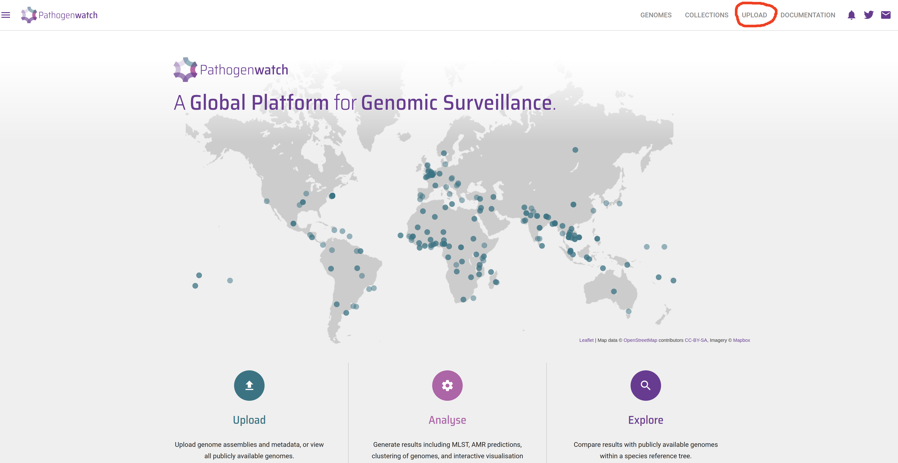
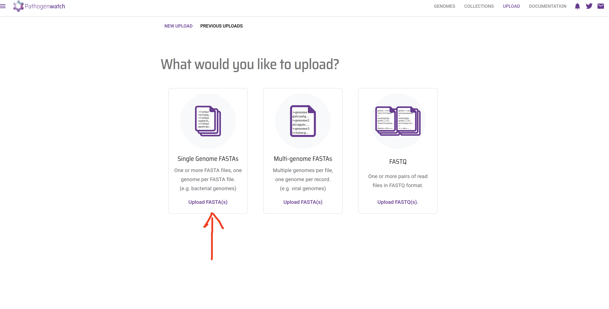
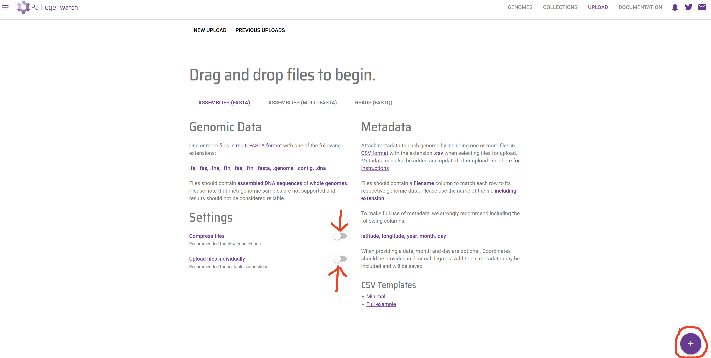
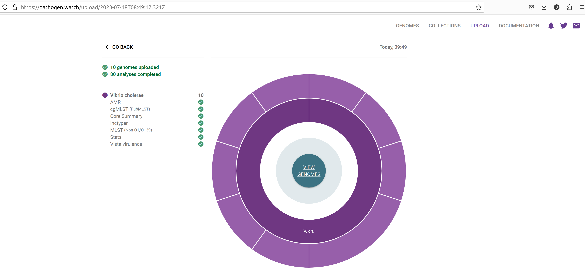
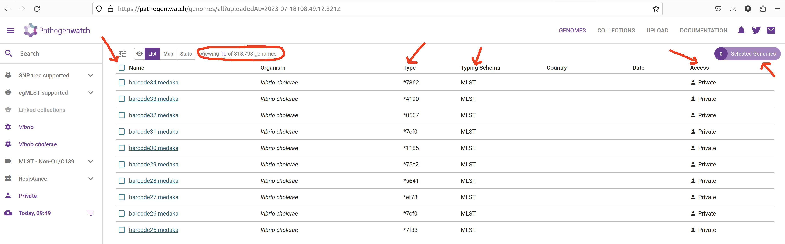
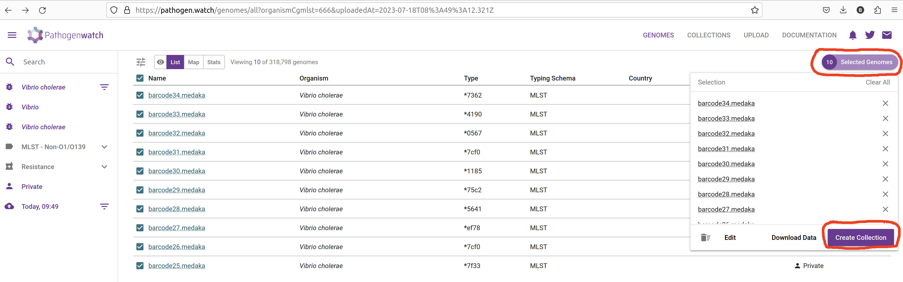
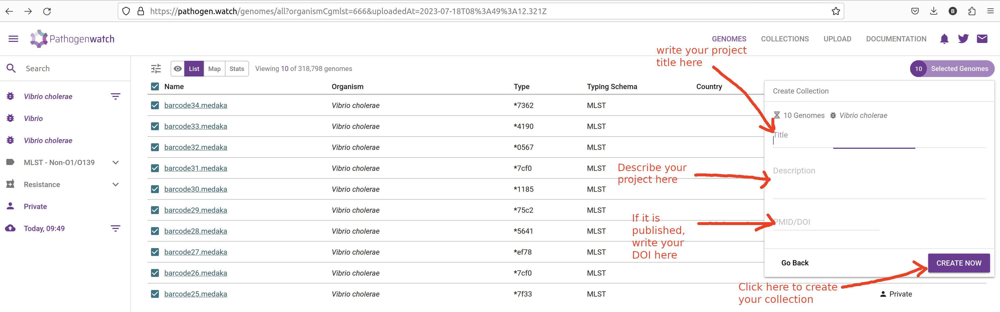
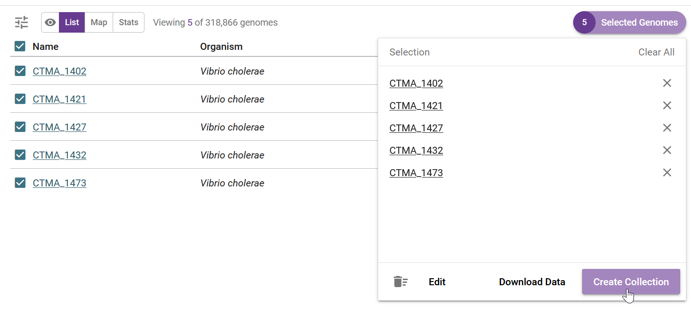
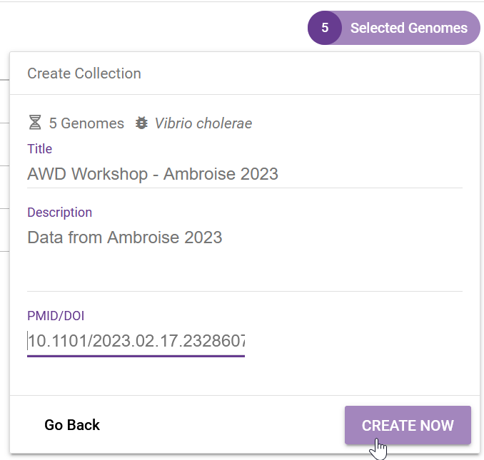
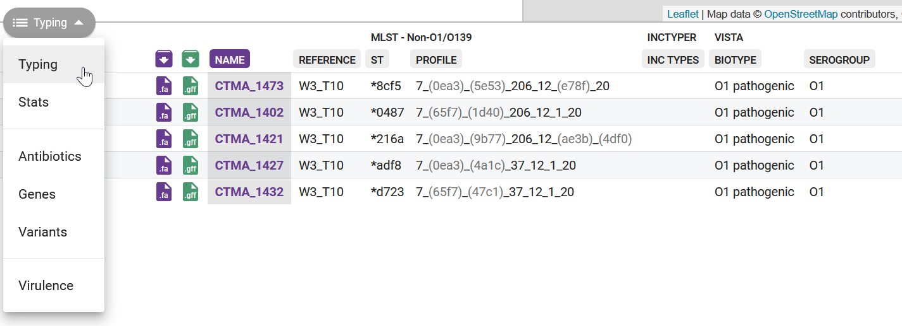

::: {.callout-tip}
#### Learning Objectives

After this section you should be able to:

- Describe what _Pathogenwatch_ is and how it can be used to aid in genomic surveillance.
- Upload files and create collections from our assemblies. 
- Become familiar with the interface to _Pathogenwatch_.
:::

## Pathogenwatch

Pathogenwatch is a web-based platform for common genomic surveillance analysis tasks, including: 

- Identifying strains for pathogens of concern.
- Cluster sequences using phylogenetic analysis.
- Identifying the presence of antibiotic resistance genes. 

Pathogenwatch is designed to be user-friendly, supporting the analysis of over 100 species, including _Vibrio cholerae_, which is our organism of focus.
In this chapter, we will cover the basics of loading genomes and creating collections for analysis on this platform. 
The details of the _Pathogenwatch_ analysis will then be covered in following chapters.

In order to use this platform you will first need to [**create an account**](https://pathogen.watch/sign-in) (or sign-in through your existing Google, Facebook or Twitter).

## Uploading FASTA files

Once you have logged in to Pathogenwatch, you can load the FASTA files with the sequences you want to analyse. 
In our case, we will load the assemblies we produced with our [genome assembly script](../02-assembly/03-genome_assembly.md). 

1. Click the **Upload** link in the top-right corner of the page:

{#fig-pathogenwatch1}

2. Click in the **Upload FASTA(s)** button, on the "Single Genome FASTAs" section: 

{#fig-pathogenwatch2}

3. If your internet connection is slow and/or unstable, you can tick "Compress files" and "Upload files individually".Click the **+** button on the bottom-right corner to upload the sequences:

{#fig-pathogenwatch3}

4. This will open a file browser, where you can select the FASTA files from your local machine. Go to the `results/assemblies` folder where you have the results from your earlier genome assembly analysis. You can upload several files at once by clicking and selecting several FASTA files while holding the <kbd>Ctrl</kbd> key. Click open on the dialogue window after you have selected all of your FASTA files.

{#fig-pathogenwatch4}

5. A new page will open showing the progress of the samples being uploaded and processed.

{#fig-pathogenwatch5}

6. Click in the **VIEW GENOMES** button, which will take you to a tabular view of your samples:

{#fig-pathogenwatch6}

_Pathogenwatch_ performs the following major analyses useful for genomic surveillance: sequence typing (ST), antimicrobial resistance (AMR) analysis, phylogenetics, as well as reporting general statistics about your samples (such as genome completeness, which we also assessed with _checkM2_).
We will detail several of these analysis in the coming chapters, but here is a brief description of each column: 

- **Name** - the names of the uploaded samples.
- **Organism** - the species that was detected for our samples, in this case _Vibrio cholerae_.
- **Type** and **Typing schema** - the sequence type assigned to each sample, based on MLST analysis (detailed in the [next chapter](02-mlst.md))
- **Country** and **Date** - the country and date of collection, respectively; only shown if we provided that information as metadata.
- **Access** - whether these samples are private or public; in this case, because they were uploaded by us, they are private (only we can see them). 

:::{.callout-note}
#### Metadata

If you have metadata files associated with your sequenced samples, you can upload those files following [these instructions](https://cgps.gitbook.io/pathogenwatch/how-to-use-pathogenwatch/uploading-assemblies#metadata).
Make sure all metadata files are in **CSV** format, with five recommended columns named 'latitude', 'longitude', 'year', 'month', and 'day'. 
You can also use the template provided by _Pathogenwatch_ on the upload page, to help you prepare your metadata files before the analysis.

Having this type of information is highly recommended, as it will allow you to visualise your samples on a map, which is useful if you want to match particular strains to the geographic locations where outbreaks occur. 
:::

## Collections

A useful feature of _Pathogenwatch_ is to group our samples into **collections**. 
This allows us to manage and analyse samples in batches of our choice. 
The same sample can exist in different collections. 
For example you might create a collection with only the genomes you sequenced recently, another collection with all the genomes you ever sequenced in your facility, or even a collection that includes your samples together with public samples available online (if you want to compare them with each other). 

To create a collection from your sequences, check the box next to the "Name" header to select all of the uploaded genomes. 
Then, from the top-rigth of the table, click **Selected Genomes** --> **Create Collection**:

{#fig-pathogenwatch7}

In the next window give a name and description to your collection: 

{#fig-pathogenwatch8}

It is highly recommended to provide details for your collection:

- **Title** - give your collection a title that is meaningful to you, for example: "Cholera workshop 2023".
- **Description** - give a brief description of your samples, for example: "Culture-based sequencing of Vibrio samples using a Nanopore platform. Samples were collected from patients in the outbreak in <COUNTRY> on <DATE>. De novo assembly was performed using Flye followed by Medaka polishing."
- If your data come from a published study, provide a DOI of the study.

Finally, click <kbd>Create Now</kbd> button to create your collection. 
You will be shown a table and map, with the samples you just added to the collection:

{#fig-pathogenwatch9}

This table contains several columns:

- **Purple <i class="fa-solid fa-download" style="color:purple"></i> download button** - download the assembled genome in FASTA format. 
  This is the same file that you just uploaded, so it's not very useful in our case. 
  It can be useful if you want to download the public sequences available from within _Pathogenwatch_. 
- **Green <i class="fa-solid fa-download" style="color:green"></i> download button** - download the gene annotation performed by _Pathogenwatch_ in GFF format. 
  Note that our assembly script already performed gene annotation using _Bakta_, so this feature is also not so useful for us. 
  But again, if you were using public sequences from _Pathogenwatch_, you could download their GFF files.
- **NAME** - your sample name. 
- **REFERENCE** - the reference lineage that your sequence was closest to. 
  [_Vibriowatch_](https://genomic-surveillance-for-vibrio-cholerae-using-vibriowatch.readthedocs.io/en/latest/mlst.html#compare-your-isolate-to-vibriowatch-s-reference-genomes) defines a set of 17 'reference genomes', 14 of which belong to current pandemic lineages (7PET). 
  Their reference genomes are named 'Wi_Tj' where 'W' stands for a _Wave_ and 'T' stands for a _Transmission event_. 
  Our samples are closest to W3_T13, which is a recent lineage. 
  This makes sense, as our samples are from isolates collected in 2023.
- **ST** and **PROFILE** - these columns refer to the "sequence type" (ST) assigned to each of our samples. We will detail this analysis in the [next chapter](02-mlst.md). 
- **BIOTYPE** and **SEROGROUP** - refer to the biotype and serogroup our samples likely belong to, based on the genes present in their genomes (we detailed how _V. cholerae_ strains are classified in an [earlier chapter](../01-introduction/01-awd_genomic_surveillance.md))

We will further analyse these results in the following chapters. 

## Exercises {#sec-ex-pathogenwatch}

<i class="fa-solid fa-triangle-exclamation" style="color: #1e3050;"></i> 
For these exercises, you can either use the dataset we provide in [**Data & Setup**](../../setup.md), or your own data. 
You also need to have completed the genome assembly exercise in @sec-ex-assembly.

:::{.callout-exercise}
#### Loading data into _Pathogenwatch_

- Load your newly assembled sequences to [_Pathogenwatch_](https://pathogen.watch/upload) 
- Create a new collection from your sequences with a name of your choice.
- Are they identified as a known biotype? Do you think these are pathogenic strains?

:::{.callout-answer collapse=true}

For the "Ambroise 2023" data, we have 5 genomes saved in `results/assemblies/`, from the assembly pipeline we ran in sec-ex-assembly.
We loaded all the FASTA files from that folder into _Pathogenwatch_:

Clicking on "View Genomes" takes us to the table of genomes, where we can select the genomes to create a new collection: 

We name our collection accordingly, and in this case we even added the associated [publication DOI](https://doi.org/10.1101/2023.02.17.23286076): 

After clicking on "Create Now" we are shown the default analysis table:

We will analyse some of these results in a later section, but we can see from the last two columns that our samples were assigned biotype "O1 pathogenic", confirming that these are pathogenic strains circulating in the population.

:::
:::

## Summary

::: {.callout-tip}
#### Key Points

- _Pathogenwatch_ is a web-based platform designed for genomic surveillance of bacterial pathogens. It assists in the analysis and interpretation of genomic data to monitor disease outbreaks and track pathogen evolution.
- You can upload genome assemblies in FASTA format and accompanying metadata as CSV files.
- Assemblies can be organized into collections, making it simpler to manage and analyze multiple samples together.
- _Pathogenwatch_'s interface offers an intuitive user experience designed for users with varying levels of expertise, providing results such as biotype/serogroup, strain classification, antimicrobial resistance (AMR) and phylogenetic placement.
:::
