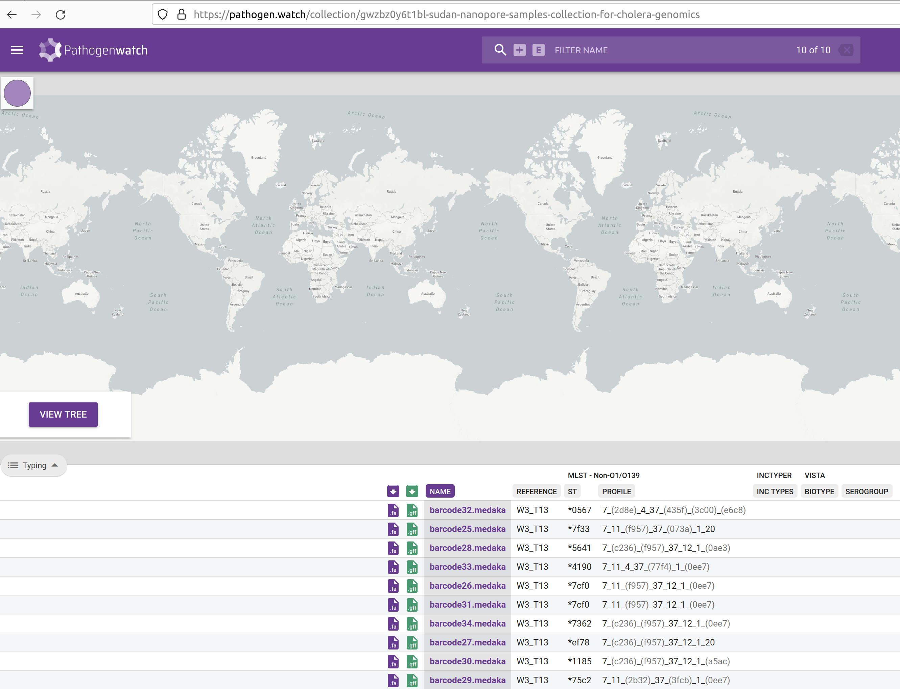

::: {.callout-tip}
#### Learning Objectives

- TODO
:::

## Pathogenwatch

Pathogenwatch is a web-based platform for common genomic surveillance analysis tasks such as: 

- Identifying strains for pathogens of concern.
- Cluster sequences using phylogenetic analysis.
- Identifying the presence of antibiotic resistance genes. 

Pathogenwatch is designed to be user-friendly, supporting the analysis of over 100 species, including _Vibrio cholerae_, which is our organism of focus.

In this chapter, we will cover how to load and save genomes into this platform to start the analysis. 
Details of the results from Pathogenwatch will then be given in the following chapters.

In order to use this platform you will first need to **create an account** (or sign-in through your existing Google, Facebook or Twitter accounts): https://pathogen.watch/sign-in

## Uploading FASTA files to Pathogenwatch

Once you have logged in to Pathogenwatch, you can load the FASTA files with the sequences you want to analyse. 
In our case, we will load the assemblies we produced with the `epi2me-labs/wf-bacterial-genomes` workflow. 

1. Click the **Upload** link in the top-right corner of the page:

{#fig-pathogenwatch1}

2. Click in the **Upload FASTA(s)** button, on the "Single Genome FASTAs" section: 

{#fig-pathogenwatch2}

3. If your internet connection is slow and/or unstable, you can tick "Compress files" and "Upload files individually".Click the **+** button on the bottom-right corner to upload the sequences:

{#fig-pathogenwatch3}

4. This will open a file browser, where you can select the FASTA files from your local machine. Go to the `results/wf-bacterial-genomes` folder where you have the results from your earlier genome assembly analysis. You can upload several files at once by clicking and selecting several FASTA files while holding the <kbd>Ctrl</kbd> key. Click open on the dialogue window after you have selected all of your FASTA files.

{#fig-pathogenwatch4}

5. A new page will open showing the progress of the samples being uploaded and processed.

{#fig-pathogenwatch5}

6. Click in the **VIEW GENOMES** button, which will take you to a tabular view of your samples:

{#fig-pathogenwatch6}

Pathogenwatch performs the following major analyses useful for genomic surveillance: sequence typing (ST), antimicrobial resistance (AMR) analysis, phylogenetics, as well as reporting general statistics about your samples (such as genome completeness, which we also checked with _checkM2_).
We will detail several of these analysis in the coming chapters, but here is a brief description of each column: 

- Name - shows the names of the uploaded samples.
- Organism - shows the species that was detected for our samples, in this case _Vibrio cholerae_.
- Type and Typing schema - the sequence type assigned to each sample, based on MLST analysis (detailed in the [next chapter](02-mlst.md))
- Country and Date - the country and date of collection, respectively, only shown if we provided that information as metadata.
- Access - indicates whether these samples are private or public. In this case, because they were uploaded by us, they are private (only we can see them). 

:::{.callout-note}
#### Metadata

If you have metadata files associated with your sequenced samples, you can upload those files as well following [these instructions](https://cgps.gitbook.io/pathogenwatch/how-to-use-pathogenwatch/uploading-assemblies#metadata).
Make sure all metadata files are in **CSV** format, with five recommended columns named 'latitude', 'longitude', 'year', 'month', and 'day'. 
You can also use the template provided by Pathogenwatch on the upload page, to help you prepare your metadata files before the analysis.

Having this type of information is highly recommended, as it will allow you to visualise your samples on a map, which is useful if you want to match particular strains to the geographic locations where outbreaks occur. 
:::

## Creating collections

A useful feature of _Pathogenwatch_ is to group our samples in so-called "collections". 
This allows us to manage and analyse samples in batches of our choice. 
The same sample can exist in different collections. 
For example you might create a collection with only the genomes you sequenced recently, another collection with all the genomes you ever sequenced in your facility, or even a collection that includes your samples together with public samples available online (if you want to compare them with each other). 

To create a collection from your sequences, check the box next to the "Name" header to select all of the uploaded genomes. 
Then, from the top-rigth of the table, click **Selected Genomes** --> **Create Collection**:

{#fig-pathogenwatch7}

In the next window give a name and description of your collection: 

{#fig-vibrio-watch-creating_a_collection_page}

It is highly recommended to provide details for your collection.

- **Title** - give your collection a title that is meaningful to you, for example: "Cholera workshop 2023"
- **Description** - give a brief description of your samples, for example: "Culture-based sequencing of Vibrio samples using a Nanopore platform. Samples were collected from patients in the outbreak in <COUNTRY> on <DATE>. Reference-based assembly was performed using the epi2me/wf-bacteria-genomes workflow."
- If your data come from the published study provide a DOI of the study (no DOI for this study).

Finally, click <kbd>Create Now</kbd> button to create your collection. 
You will be shown a table and map, with the samples you just added to the collection:

{#fig-vibrio-watch-collection_analaysis_table}

with the names of your barcoded samples and predicted typings (using MLST) with reference used to call the typing, in this case W3_T13. In addition, the profile for each genome isolate will be displayed.

This table contains several columns:

- **Purple <i class="fa-solid fa-download" style="color:purple"></i> download button** - download the assembled genome in FASTA format. This is the same file that you just uploaded, so it's not very useful in this case. But if you were looking at some public sequences available from _Pathogenwatch_, you may want to download them for other analysis. 
- **Green <i class="fa-solid fa-download" style="color:green"></i> download button** - download the gene annotation performed automatically by _Pathogenwatch_ in GFF format. Note that our `epi2me` pipeline also performed a gene annotation using _prokka_. So, we don't necessarily need another annotation from Pathogenwatch. But again this could be useful for public sequences you want to use in your own analysis. 
- **NAME** - this is your sample name. 
- **REFERENCE** - this is the reference lineage that your sequence was closest to. [_Vibriowatch_](https://genomic-surveillance-for-vibrio-cholerae-using-vibriowatch.readthedocs.io/en/latest/mlst.html#compare-your-isolate-to-vibriowatch-s-reference-genomes) defines a set of 17 'reference genomes', 14 of which belong to current pandemic lineages (7PET). Their reference genomes are named 'Wi_Tj' where 'W' stands for a _Wave_ and 'T' stands for a _Transmission event_. Our samples are closest to W3_T13, which the most recent lineage. This makes sense, as our samples are from isolates collected in 2023.
- **ST** and **PROFILE** - these columns refer to the "sequence type" (ST) assigned to each of our samples. We will detail this analysis in the [next chapter](02-mlst.md). 
- **BIOTYPE** and **SEROGROUP** - refer to the biotype and serogroup our samples likely belong to, based on the genes present in their genomes (we detailed how _V. cholerae_ strains are classified in an [earlier chapter](../01-introduction/01-awd_genomic_surveillance.md))

We will further analyse these results in the following chapters. 

## Exercises 

:::{.callout-exercise}
#### Pathogenwatch

Load your sequences to pathogenwatch and create a new collection from them.

TODO - improve description of exercise.

:::

## Summary

::: {.callout-tip}
#### Key Points

- TODO
:::
