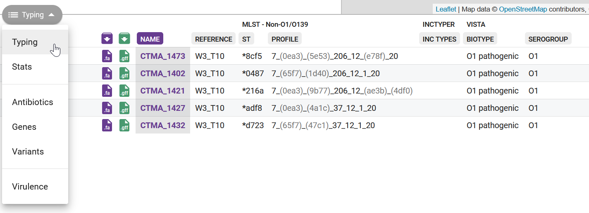

::: {.callout-tip}
#### Learning Objectives

- TODO
:::


## Multilocus Sequence Typing (MLST)

MLST has become a common method for identifying and charactering pathogenic bacterial strains. 
It uses a specific set of "housekeeping genes" linked to the bacteria of interest. 
These genes help categorize isolates into groups based on the changes they carry within these genes. 
MLST aids in identifying changes in the genetic sequences of isolates during new outbreaks, which adds to other methods like serotyping for classifying strains. 
This is why public health labs often rely on MLST to assist officials in comprehending and controlling disease outbreaks.

Groups of isolates that share similar mutation patterns in these housekeeping genes are called **sequence types**. 
The [PubMLST](https://pubmlst.org/) project curates and maintains these sequence types. 
For example, sequence type 69 ([ST69](https://pubmlst.org/bigsdb?page=profileInfo&db=pubmlst_vcholerae_seqdef&scheme_id=1&profile_id=69)) is a common type linked to _O1 El Tor_ strains in the current pandemic (7PET). 
Although this method might seem a bit old-fashioned in the age of genomic analysis (as it focuses on only 7 genes), it offers a uniform and comparable way to categorize strains across different labs and locations.

This sequence typing approach helps determine whether any of our tested isolates are harmful. 
_V. cholerae_ typing is done from seven housekeeping genes (_adk_, _gyrB_, _metE_, _mdh_, _pntA_, _purM_, and _pyrC_). 
Using this approach, we aim to determine which pandemic strain types dominate our isolates or whether we've stumbled upon new strain types. 
This analysis can be accomplished through _Pathogenwatch_ or by using a separate command line tool called `mlst`.


## MLST with Pathogenwatch

_Pathogenwatch_ uses [PubMLST](https://pubmlst.org/) to run its typing analysis ([details here](https://cgps.gitbook.io/pathogenwatch/technical-descriptions/typing-methods/mlst)) and the results can be seen on the collection view page (@fig-pathogenwatch).

{#fig-pathogenwatch}

All of the sequence types determined by MLST in our samples seem to be novel (this is indicated by an `*` before the name). 
This seems very surprising, as there must be other strains similar to ours identified in recent outbreaks. 
There are several reasons why we may have obtained this result: 

- The PubMLST database may not contain up-to-date sequence types for most recent _Vibrio_ lineages circulating worldwide. 
- Even if only one of the 7 genes used for typing contains a mutation, MLST already considers it to be a different type from the one in the database. 
- Because we are using Nanopore data, which has relatively high error rates, we may have some errors in our assemblies, which now affects this analysis. 

<!-- 
The first step is to download selected public available complete whole genomes of V.cholerae from NCBI which are pandemic strains but also for control we download non-pandemic strains (with known sequence typing in both cases). We download two files for each genome; one with contigs FASTA sequences and other one is annotated genome sequences GFF as described above.
-->


## MLST with command line {#sec-mlst-cli}

Running MLST from the command line can be done with a single command, as exemplified on this script:

```bash
#!/bin/bash

# create output directory
mkdir results/mlst

# run mlst
mlst --scheme vcholerae results/assemblies/*.fasta > results/mlst/mlst_typing.tsv
```

This command outputs a tab-delimited file (TSV), which we can open in a spreadsheet software such as _Excel_. 
Here is the result for our samples:

```
results/assemblies/isolate01.fasta  vcholerae  -  adk(7)  gyrB(11)    mdh(~133)  metE(37)   pntA(12?)   purM(1)     pyrC(20?)
results/assemblies/isolate02.fasta  vcholerae  -  adk(7)  gyrB(~11)   mdh(4)     metE(37)   pntA(227?)  purM(1)     pyrC(20?)
results/assemblies/isolate03.fasta  vcholerae  -  adk(7)  gyrB(11)    mdh(~121)  metE(37)   pntA(227?)  purM(1)     pyrC(20?)
results/assemblies/isolate04.fasta  vcholerae  -  adk(7)  gyrB(120?)  mdh(~4)    metE(37)   pntA(227?)  purM(1)     pyrC(20?)
results/assemblies/isolate05.fasta  vcholerae  -  adk(7)  gyrB(120?)  mdh(~121)  metE(37)   pntA(227?)  purM(1)     pyrC(~20)
results/assemblies/isolate06.fasta  vcholerae  -  adk(7)  gyrB(195?)  mdh(~121)  metE(37)   pntA(227?)  purM(1)     pyrC(20?)
results/assemblies/isolate07.fasta  vcholerae  -  adk(7)  gyrB(195?)  mdh(~121)  metE(37)   pntA(-)     purM(1)     pyrC(20?)
results/assemblies/isolate08.fasta  vcholerae  -  adk(7)  gyrB(120?)  mdh(209?)  metE(37)   pntA(227?)  purM(172?)  pyrC(20?)
results/assemblies/isolate09.fasta  vcholerae  -  adk(7)  gyrB(120?)  mdh(~121)  metE(~37)  pntA(12?)   purM(176?)  pyrC(20?)
results/assemblies/isolate10.fasta  vcholerae  -  adk(7)  gyrB(195?)  mdh(~121)  metE(37)   pntA(227?)  purM(1)     pyrC(20?)
```

We get a column for each of the 7 genes used for _Vibrio_ sequence typing, with the gene name followed by the allele number in parenthesis. 
The allele number is an identifier used by PubMLST, and it means that allele has a specific sequence with a certain set of variants ([search for alleles here](https://pubmlst.org/bigsdb?db=pubmlst_vcholerae_seqdef&page=alleleQuery)). 
For example, `adk(7)` corresponds to [allele 7 of the _adk_ gene](https://pubmlst.org/bigsdb?db=pubmlst_vcholerae_seqdef&page=alleleInfo&locus=VCHOL0445&allele_id=7).

The command line version of `mlst` also reports when an allele has an inexact match to the allele in the database, with the following notation (copied from [the README documentation](https://github.com/tseemann/mlst)):

| Symbol | Meaning                                   | Length            | Identity       |
| ------ | ----------------------------------------- | ----------------- | -------------- |
| `n`    | Exact intact allele                       | 100%              | 100%           |
| `~n`   | Novel full length allele _similar_ to `n` | 100%              | ≥ `--minid`    |
| `n?`   | Partial match to known allele             | ≥ `--mincov`      | ≥ `--minid`    |
| `-`    | Allele missing                            | < `--mincov`      | < `--minid`    |
| `n,m`  | Multiple alleles                          |                   |                |


The third column of the output (which in our case is `-` for all samples) would indicate if our samples matched a known sequence type from the _PubMLST_ database. 
It seems like all our samples are "new" sequence types, i.e. their profile doesn't exactly match any of the curated types. 
We can further interpret our results by [searching for their closest-matching profiles](https://pubmlst.org/bigsdb?db=pubmlst_vcholerae_seqdef&page=profiles) on the _PubMLST_ website.
If we search on that page for the profiles of each isolate, we will find that they always come closest to the sequence type [ST69](https://pubmlst.org/bigsdb?page=profileInfo&db=pubmlst_vcholerae_seqdef&scheme_id=1&profile_id=69), which includes the pathogenic _O1 El Tor_ strain.
For example, "isolate02" matches ST69 for six out of the seven genes. 

While somewhat inconclusive about an exact sequence type, this analysis further reinforces that we are faced with pathogenic strains of _Vibrio cholerae_. 
In the [next chapter](03-phylogeny.md) we will turn to phylogenetic analysis to further investigate the relationship between these strains and other previously sequenced strains of this species. 

<!-- TODO - add `vcholerae_2` scheme (for 01 and 0139) -->


## Exercises 

<i class="fa-solid fa-triangle-exclamation" style="color: #1e3050;"></i> 
For these exercises, you can either use the dataset we provide in [**Data & Setup**](../../setup.md), or your own data. 
You also need to have completed the genome assembly exercise in @sec-ex-assembly.

:::{.callout-exercise}
#### MLST (command line)

Perform MLST analysis from the command line:

- Activate the software environment: `mamba activate typing`
- Use the command line version of `mlst` to analyse your sequences, as explained in @sec-mlst-cli.
  You can either run the commands shown in that section directly on the terminal, or you can save them in a script called `scripts/04-mlst.sh`.
  Writing the commands in a script will make sure you have a record to run again in the future. 

- After the analysis runs, answer the following questions: 
  - Did any of your assemblies get assigned to known types?
  - Go to the [_PubMLST_ allelic profile search](https://pubmlst.org/bigsdb?db=pubmlst_vcholerae_seqdef&page=profiles) and search for the closest profile to your samples. 
  - Do you think all your samples are likely from the same outbreak event or transmission chain?

:::{.callout-answer collapse=true}

To run this analysis, we created a shell script with the following code: 

```bash
#!/bin/bash

# create output directory
mkdir results/mlst

# run mlst
mlst --scheme vcholerae results/assemblies/*.fasta > results/mlst/mlst_typing.tsv
```

We then opened the output file in _Excel_, which contained the following:

```
results/assemblies/CTMA_1402.fasta  vcholerae  -  adk(7)  gyrB(~11)   mdh(121?)  metE(206)  pntA(12)  purM(1)     pyrC(20)
results/assemblies/CTMA_1421.fasta  vcholerae  -  adk(7)  gyrB(120?)  mdh(~45)   metE(206)  pntA(12)  purM(176?)  pyrC(~20)
results/assemblies/CTMA_1427.fasta  vcholerae  -  adk(7)  gyrB(120?)  mdh(223?)  metE(37)   pntA(12)  purM(1)     pyrC(20)
results/assemblies/CTMA_1432.fasta  vcholerae  -  adk(7)  gyrB(~11)   mdh(223?)  metE(37)   pntA(12)  purM(1)     pyrC(20)
results/assemblies/CTMA_1473.fasta  vcholerae  -  adk(7)  gyrB(120?)  mdh(209?)  metE(206)  pntA(12)  purM(176?)  pyrC(20)
```

None of our samples were assigned to standard sequence types (third column, with `-`). 

When we search for these profiles on _PubMLST_, some of them seem to have closest resemblance to ST515. 
Others have some resemblance to ST69. 
Both of these sequence types are associated with _O1 El Tor_ pathogenic strains, confirming we are dealing with pathogenic strains. 

The fact that our samples seem to have different profiles may suggest they represent different outbreak events or sources of transmission. 
We would need to investigate this more thoroughly by considering any metadata associated with these samples (such as date and place of origin). 
:::
:::


:::{.callout-exercise}
#### MLST (Pathogenwatch)

Following from the _Pathogenwatch_ exercise in @sec-ex-pathogenwatch, open the "Ambroise 2023" collection that you created and answer the following questions:

- Which sequence type were your sequences assigned to?
- How do the results compare with output from the command line version of the software? (You need to complete the previous exercise to answer this question)

:::{.callout-answer collapse=true}

First, we make sure to be on the collection view screen for our "AWD Workshop - Ambroise 2023" collection created earlier (@sec-ex-pathogenwatch). 
In case you don't have it open, you can get it from the account menu (top-left button, as shown on image below) and click on "My Collections".
Your collection should be listed and you can click on "View Colection". 


Once inside the collection view, the MLST table is usually the one shown by default, or you can choose it from the drop-down menu on the top-left of the table: 



From this table we can see that: 

- All of our samples were assigned a new type. This is indicated by the `*` in the `ST` column. 
- The results are very similar to the command line version of the tool, except we don't get information about similar alleles that were matched to the new gene alleles found. 

:::
:::


## Summary

::: {.callout-tip}
#### Key Points

- TODO
:::
