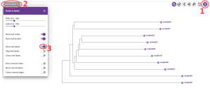
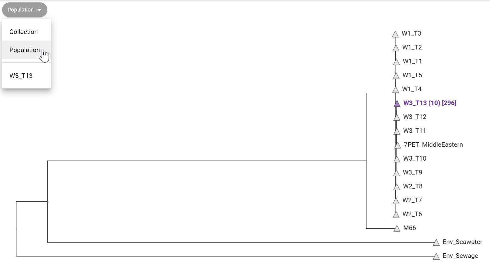
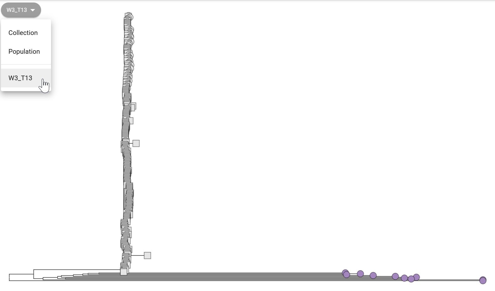
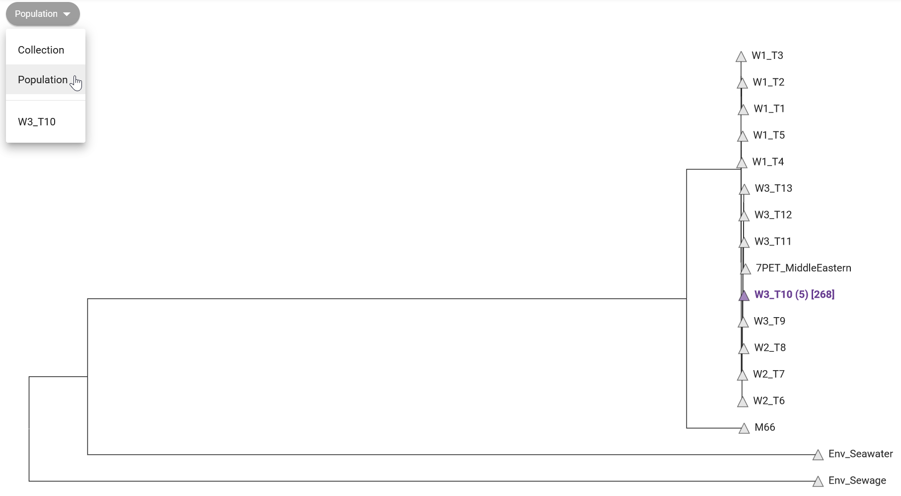
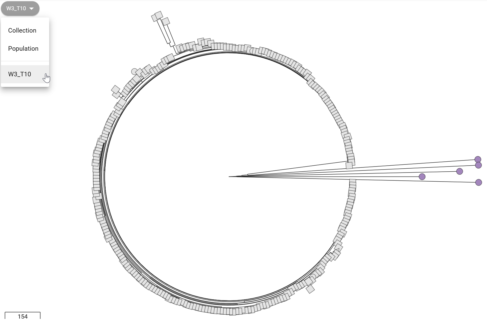
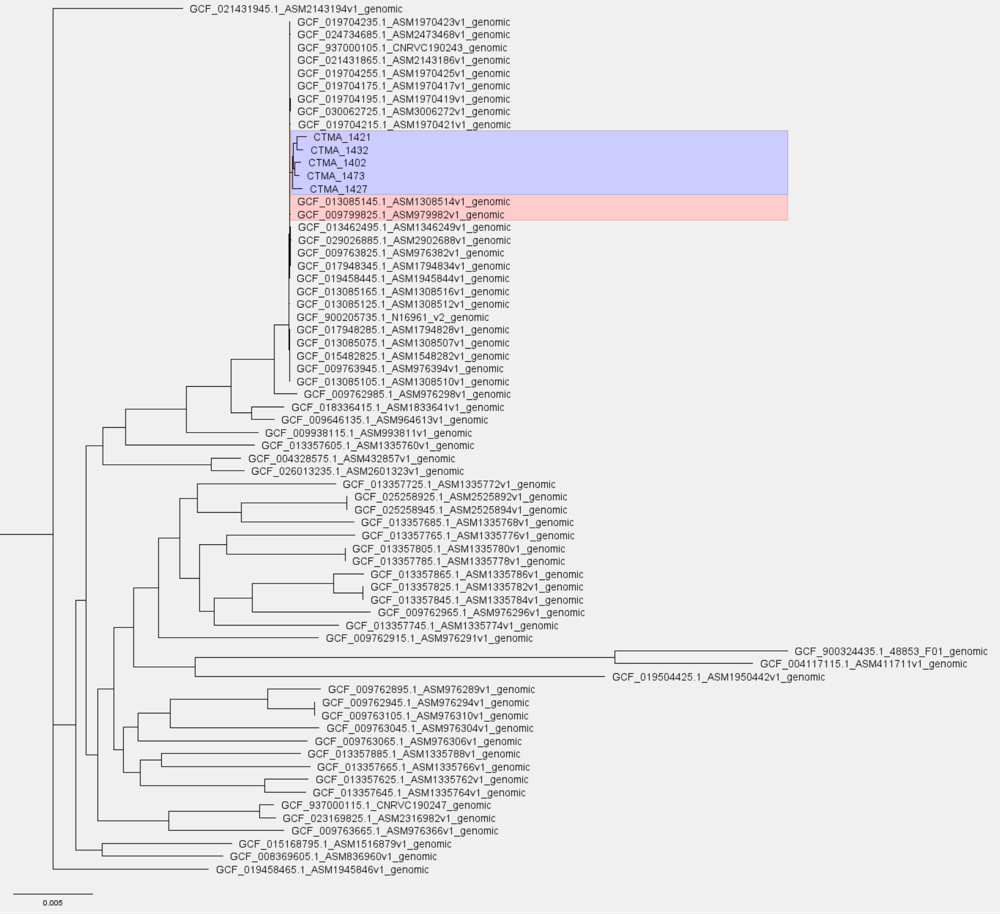

::: {.callout-tip}
#### Learning Objectives

- TODO
:::


## Pathogen Phylogenetics

Phylogenetic analysis aims to determine evolutionary relationships among organisms. 
In the context of pathogenic organisms, it is used to study the origin of human-infecting strains. 
This involves analyzing sequences from various bacterial/viral species infecting humans and other species. 
For instance, during the COVID-19 pandemic, inter-species phylogeny was used to [trace the origin of the SARS-CoV-2 virus](https://doi.org/10.1007/s10311-020-01151-1) that adapted to infect humans.

Pathogen surveillance mostly focuses on intra-species phylogenies. 
Here, phylogenies are constructed from sequences within the same pathogenic species. 
The objective is to understand how specific strains and lineages relate and evolve. 
By analyzing genetic differences, we can track pathogen spread and identify outbreak sources. 
This section aims to answer: how do our Vibrio cholerae isolates relate to each other and to previously sequenced strains? 
This sheds light on relationships among isolates and their evolutionary context.

To construct a phylogeny, two primary steps are necessary:

- **Multiple sequence alignment:** to account for variations in sequence lengths due to insertions/deletions, aligning homologous residues of each sequence is the first step.
- **Tree inference:** with the aligned sequences, statistical models of sequence evolution are used to infer the most probable relationship between these sequences, based on observed substitutions.

Multiple sequence alignment is straightforward when dealing with a single gene or closely related species (e.g. clonal bacterial species). 
However, bacterial species can exhibit substantial differences due to factors like horizontal gene transfer (e.g. through conjugation or bacteriophages), gene duplication, and gene loss. 
In such cases, alignment focuses on the **core genome**, the gene set present in most species members, enabling inference of evolutionary relationships. 
This contrasts with the "accessory genome," consisting of genes present only in some members of the species. 
The complete collection of core and accessory genomes in a species is referred to as the **pangenome**.

Given the diversity of _Vibrio cholerae_, which often acquires resistance genes through horizontal transfer, the phylogenetic process begins with generating a **core genome alignment**, forming the foundation for tree inference. 
We will explore phylogenetic analysis of _Vibrio cholerae_ using _Pathogenwatch_, followed by a guide to constructing your own phylogenies using command line tools.


## Phylogenies with Pathogenwatch

In the "collection view" screen for your samples, _Pathogenwatch_ shows you a phylogenetic tree on the top-left panel, showing the relationship between the sequences in your collection. 
This shows how tightly our samples cluster with each other, and outliers may indicate assembly issues. 
For example, we can see from @fig-phylo-pathogenwatch1 that "isolate05" clusters separately from the rest of the samples. 
From our [previous analysis of assembly quality](../02-assembly/04-assembly_quality.md) we saw that this sample had poorer sequencing coverage, which may have led to a higher error rate (because fewer sequencing reads were available to identify a consensus sequence). 

{#fig-phylo-pathogenwatch1}

We can also show how your samples relate to the "reference genomes" available in _Pathogenwatch_ (@fig-phylo-pathogenwatch2).
These are genomes curated by the [_Vibriowatch_ project](https://genomic-surveillance-for-vibrio-cholerae-using-vibriowatch.readthedocs.io/en/latest/mlst.html#compare-your-isolate-to-vibriowatch-s-reference-genomes), which include several genomes that have been assigned to different phylogenetic lineages, and associated with transmission waves/events.

{#fig-phylo-pathogenwatch2}

In @fig-phylo-pathogenwatch2 we can see that all our 10 samples fall in the "W3_T13" clade (wave 3, transmission event 13). 
This reference clade corresponds to strains from the most recent transmission wave in Africa determined by [Weill et al. 2017](https://doi.org/10.1126/science.aad5901). 
This agrees with other pieces of evidence we aquired so far, that our strains are closely related to the most recent pathogenic strains circulating worldwide. 

You can further "zoom in" on the tree to see how your samples relate to the reference samples present in this clade (@fig-phylo-pathogenwatch3). 
This shows that although our samples are related to W3 T3 reference samples, they have accumulated enough mutations that makes them cluster apart from the reference panel. 
Note that some of the lineage classification used by _Pathogenwatch_ may be slightly outdated, as new strains emerge that were not part of the 2017 study mentioned above. 

{#fig-phylo-pathogenwatch3}


### Using public genomes

We don't have to restrict our analysis to only the genomes provided by _Pathogenwatch_. 
We can create our own collections using publicly available genomes, for example [downloaded from NCBI](../02-assembly/01-preparing_data.md).

TODO - phylogeny with NCBI genomes


## Phylogenies with local software

In the previous section we used _Pathogenwatch_ to perform a phylogenetic analysis, using both our sequences and other _Vibrio_ genomes downloaded from NCBI. 
While Pathogenwatch is user-friendly, it relies on a web-based service that might not always be accessible. 
Therefore, we introduce an alternative using command line tools suitable for local execution on your computer.
The methodology we use here is similar to _Pathogenwatch_'s, but it employs distinct tools for generating the core genome and performing tree inference. 
Our toolkit consists of three software components:

- **[Panaroo](https://gtonkinhill.github.io/panaroo/#/gettingstarted/quickstart)** - used to identify a set of "core genes" (genes occurring in most samples) and generate a multiple sequence alignment from them.
- **[IQ-TREE](http://www.iqtree.org/doc/)** - used to infer a tree from the aligned core genes.
- **[Figtree](http://tree.bio.ed.ac.uk/software/figtree/)** - used to visualise and/or annotate our tree.


### Core genome alignment: `panaroo` {#sec-panaroo}

The software [_Panaroo_](https://gtonkinhill.github.io/panaroo/) was developed to analyse bacterial pangenomes. 
It is able to identify orthologous sequences between a set of sequences, which it uses to produce a multiple sequence alignment of the core genome. 
The output alignment it produces can then be used to build our phylogenetic trees in the next step.

As input to _Panaroo_ we will use: 

- The gene annotations for our newly assembled genomes, which were produced during the [assembly pipeline](../02-assembly/03-genome_assembly.md) using _Bakta_. 
- Annotations from [public genomes downloaded from NCBI](https://www.ncbi.nlm.nih.gov/datasets/genome/?taxon=666&annotated_only=true&refseq_annotation=true&typical_only=true&assembly_level=3%3A3&release_year=2019%3A2023). 
  We chose complete genomes, annotated by NCBI RefSeq and submitted between 2019-2023 (a total of 63 genomes at the time these materials were written). 
  These annotations had to be processed to be compatible with _Panaroo_, which we detail in the information box below. 

To run _Panaroo_ on our samples we can use the following commands:

```bash
# create output directory
mkdir results/panaroo

# run panaroo
panaroo \
  --input results/assemblies/*.gff resources/vibrio_genomes/*.gff \
  --out_dir results/panaroo \
  --clean-mode strict \
  --alignment core \
  --core_threshold 0.98 \
  --remove-invalid-genes \
  --threads 8
```

The options used are: 

- `--input` - all the input annotation files, in the _Panaroo_-compatible GFF format. Notice how we used the `*` wildcard to match all the files in each folder: the `results/assemblies` folder contains the annotations for our own genomes; the `resources/vibrio_genomes/` folder contains the public annotations (suitably converted to _Panaroo_-compatible format - see information box below). 
- `--out_dir` - the output directory we want to save the results into.
- `--clean-mode` - determines the stringency of _Panaroo_ in including genes within its pangenome graph for gene clustering and core gene identification. The available modes are 'strict', 'moderate', and 'sensitive'. These modes balance eliminating probable contaminants against preserving valid annotations like infrequent plasmids. In our case we used 'strict' mode, as we are interested in building a core gene alignment for phylogenetics, so including rare plasmids is less important for our downstream task.
- `--alignment` - whether we want to produce an alignment of core genes or all genes (pangenome alignment). In our case we want to only consider the core genes, to build a phylogeny.
- `--core_threshold` - the fraction of input genomes where a gene has to be found to be considered a "core gene". In our case we've set this to a very high value, to ensure most of our samples have the gene.
- `--remove-invalid-genes` - this is recommended to remove annotations that are incompatible with the annotation format expected by _Panaroo_. 
- `--threads` - how many CPUs we want to use for parallel computations.

_Panaroo_ takes a long time to run, so be prepared to wait a while for its analysis to finish <i class="fa-solid fa-mug-hot"></i>. 

Once if finishes, we can see the output it produces:

```bash
ls results/panaroo
```

```
aligned_gene_sequences/                core_alignment_header.embl        gene_presence_absence_roary.csv
alignment_entropy.csv                 core_gene_alignment.aln           pan_genome_reference.fa
combined_DNA_CDS.fasta                core_gene_alignment_filtered.aln  pre_filt_graph.gml
combined_protein_CDS.fasta            final_graph.gml                   struct_presence_absence.Rtab
combined_protein_cdhit_out.txt        gene_data.csv                     summary_statistics.txt
combined_protein_cdhit_out.txt.clstr  gene_presence_absence.Rtab
core_alignment_filtered_header.embl   gene_presence_absence.csv
```

There are several output files generated, which can be generated for more advanced analysis and visualisation (see [_Panaroo_ documentation](https://gtonkinhill.github.io/panaroo/#/gettingstarted/quickstart) for details). 
For our purpose of creating a phylogeny from the core genome alignment, we need the file `core_gene_alignment.aln`, which is a file in FASTA format. 
We can take a quick look at this file: 

```bash
head results/panaroo/core_gene_alignment.aln
```

```
>GCF_015482825.1_ASM1548282v1_genomic
atggctatttatctgactgaattatcgccggaaacgttgacattcccctctccttttact
gcgttagatgaccctaacggcctgcttgcatttggcggcgatctccgtcttgaacgaatt
tgggcggcttatcaacaaggcattttcccttggtatggccctgaagacccgattttgtgg
tggagcccttccccacgtgccgtgtttgaccctactcggtttcaacctgcc-aaaagcgt
gaagaagttccaacgtaaacatcagtatcgggttagcgtcaatcacgcgacgtcgcaagt
gattgagcagtgcgcgctcactcgccctgcggatcaacgttggctcaatgactcaatgcg
ccatgcgtatggcgagttggcgaaacaaggtcgttgccattctgttgaggtgtggcaggg
cgaacaactggtgggtgggctttatggcatttccgttggccaactgttttgtggcgaatc
catgtttagcctcgcaaccaatgcctcgaaaattgcgctttggta-tttttgcgaccatt
```

We can see this contains a sequence named "GCF_015482825.1_ASM1548282v1_genomic", which corresponds to one of the NCBI genomes we downloaded. 
We can look at all the sequence names in the FASTA file: 

```bash
grep ">" results/panaroo/core_gene_alignment.aln
```

```
>GCF_015482825.1_ASM1548282v1_genomic
>GCF_019704235.1_ASM1970423v1_genomic
>GCF_013357625.1_ASM1335762v1_genomic
>GCF_017948285.1_ASM1794828v1_genomic
>GCF_009763825.1_ASM976382v1_genomic
>isolate01
>GCF_013357665.1_ASM1335766v1_genomic
>GCF_009762915.1_ASM976291v1_genomic
>GCF_009762985.1_ASM976298v1_genomic

... more output omitted to save space ...
```

We can see each input genome appears once, including the "isolateXX" genomes assembled and annotated by us.


### Tree inference: `iqtree` {#sec-iqtree}

There are different methods for inferring phylogenetic trees from sequence alignments. 
Regardless of the method used, the objective is to construct a tree that represents the evolutionary relationships between different species or genetic sequences.
Here, we will use the _IQ-TREE_ software, which implements **maximum likelihood methods of tree inference**.
Phylogenetic tree inference using maximum likelihood is done by identifying the tree that maximizes the likelihood of observing the given DNA sequences under a chosen evolutionary model.

In this process, **DNA substitution models** describe how DNA sequences change over time due to mutations. 
These models consider how frequently different bases (A, T, C, G) are replaced by each other. 
Another parameter these models can include is **rate heterogeneity**, which accounts for the fact that different DNA sites may evolve at different rates. 
Some sites might change rapidly, while others remain more stable.

Maximum likelihood aims to find the tree topology and branch lengths that make the observed DNA sequences most probable, given the chosen model. 
It does this by exploring various tree shapes and lengths to calculate the likelihood of the observed sequences. 
The tree with the highest likelihood is considered the best representation of the evolutionary relationships among the sequences. 
The process involves making educated guesses about the tree's parameters, calculating the likelihood of the data under these guesses, and refining the parameters iteratively to find the optimal tree that best explains the observed genetic variations.

_IQ-TREE_ offers various sequence evolution models, allowing researchers to match their analyses to different types of data and research questions.
Conveniently, this software can identify the most fitting substituion model for a dataset (using a tool called [_ModelFinder_](https://www.nature.com/articles/nmeth.4285)), while considering the complexity of each model.

We run _IQ-TREE_ on the output from _Panaroo_, i.e. using the core genome alignment to construct the phylogeny:

```bash
# create output directory
mkdir results/iqtree

# run iqtree2
iqtree -s results/panaroo/core_gene_alignment.aln --prefix results/iqtree/awd -m GTR+F+I
```

The options used are: 

- `-s` - the input alignment file.
- `--prefix` - the name of the output files. This will be used to name all the files with a "prefix". In this case we are using the "awd" prefix, which is very generic. In your own analysis you may want to use a more specific prefix (for example, the name of the collection batch). 
- `-m` - specifies the DNA substitution model we'd like to use. We give more details of this option below. 

When not specifying the `-m` option, `iqtree` employs _ModelFinder_ to pinpoint the substitution model that best maximizes the data's likelihood, as previously mentioned. 
Nevertheless, this can be time-consuming (as `iqtree` needs to fit trees numerous times). 
An alternative approach is utilizing a versatile model, like the one chosen here, "GTR+F+I," which is a [generalized time reversible (GTR) substitution model](https://en.wikipedia.org/wiki/Substitution_model#Generalised_time_reversible). 
This model requires an estimate of the base frequencies within the sample population, determined in this instance by tallying the base frequencies from the alignment (indicated by "+F" in the model name). 
Lastly, the model accommodates variations in rates across sites, including a portion of invariant sites (noted by "+I" in the model name).

We can look at the output folder: 

```bash
ls results/iqtree
```

```

```

There are several files with the following extension: 

- `.iqtree` - a text file containing a report of the IQ-Tree run, including a representation of the tree in text format.
- `.treefile` - the estimated tree in NEWICK format. We can use this file with other programs, such as _FigTree_, to visualise our tree. 
- `.log` - the log file containing the messages that were also printed on the screen. 
- `.bionj` - the initial tree estimated by neighbour joining (NEWICK format).
- `.mldist` - the maximum likelihood distances between every pair of sequences.
- `ckp.gz` - this is a "checkpoint" file, which IQ-Tree uses to resume a run in case it was interrupted (e.g. if you are estimating very large trees and your job fails half-way through).
- `.model.gz` - this is also a "checkpoint" file for the model testing step. 

The main files of interest are the report file (`.iqtree`) and the tree file (`.treefile`) in standard [Newick format](https://en.wikipedia.org/wiki/Newick_format).


### Visualising trees: FigTree

There are many programs that can be used to visualise phylogenetic trees. 
In this course we will use _FigTree_, which has a simple graphical user interface.
You can open _FigTree_ from the terminal by running the command `figtree`. 

To open the tree, go to <kbd><kbd>File</kbd> > <kbd>Open...</kbd></kbd> and browse to the folder with the _IQ-TREE_ output files. 
Select the file with `.treefile` extension and click <kbd>Open</kbd>.
You will be presented with a visual representation of the tree. 

We can also import a "tab-separated values" (TSV) file with annotations to add to the tree, if you have any available (e.g. country of origin, date of collection, etc.). 
To add annotations:

- Go to <kbd><kbd>File</kbd> > <kbd>Import annotations...</kbd></kbd> and open the annotation file. This file has to be in tab-delimited format.
- On the menu on the left, click <kbd>Tip Labels</kbd> and under "Display" choose one of the fields of our metadata table. 

There are many ways to further configure the tree, including highlighting clades in the tree, and change the labels. 
See the @fig-phylo-figtree for an example. 

{#fig-phylo-figtree}

<!-- we need to add some metadata to this, otherwise very difficult to interpret -->


## Exercises

<i class="fa-solid fa-triangle-exclamation" style="color: #1e3050;"></i> 
For these exercises, you can either use the dataset we provide in [**Data & Setup**](../../setup.md), or your own data. 
You also need to have completed the genome assembly exercise in @sec-ex-assembly.

:::{.callout-exercise}
#### Pathogenwatch phylogeny

Following from the _Pathogenwatch_ exercise in @sec-ex-pathogenwatch, open the "Ambroise 2023" collection that you created and answer the following questions:

- Does any of your sequences look like an outlier (i.e. a very long branch) in the sample tree view?
- Change the tree view to "Population". Which transmission wave do your samples cluster with?
- Looking within the population(s) where your samples cluster in, do your samples cluster together or are they interspersed between other samples from the _Pathogenwatch_ collection?

:::{.callout-answer collapse=true}

Looking at our samples' tree doesn't reveal any sample as a particular outlier. 

Looking at the "Population" view (from the dropdown on the top-left, as shown below), we can see that all of the "Ambroise 2023" samples fall within the "W3_T10" clade. 
This is a recent transmission wave, confirming our strains are pathogenic and related to other recent strains ([Weill et al. 2017](https://doi.org/10.1126/science.aad5901)). 



Looking inside the clade, we can see that our samples cluster somewhat apart from the rest, suggesting they are more similar to each other than they are with the samples from the _Pathogenwatch_ collection. 
This might be because our samples are from 2023, whereas the collection from _Pathogenwatch_ is from 2017, so it is likely that these strains have accumulated new mutations since then.



Note that in the image above we changed our tree layout to a "circle". Sometimes this view is helpful when we have too many sequences. 

:::
:::

:::{.callout-exercise}
#### Core genome alignment

Using _Panaroo_, perform a core genome alignment for your assembled sequences together with the public genomes we provide in `resources/vibrio_genomes/`. 

- Activate the software environment: `mamba activate typing`.
- Fix the script we provide in `scripts/05-panaroo.sh`. See @sec-panaroo if you need a hint of how to fix the code in the script.
- Run the script using `bash scripts/05-panaroo.sh`.

When the analysis starts you will get several messages and progress bars print on the screen.
This analysis takes a long time to run (several hours), so you will have to leave it running before continuing to the next exercise. 

:::{.callout-answer collapse=true}

The fixed code for our script is:

```bash
#!/bin/bash

# create output directory
mkdir -p results/panaroo/

# Run panaroo
panaroo \
  --input results/assemblies/*.gff resources/vibrio_genomes/*.gff \
  --out_dir results/panaroo \
  --clean-mode strict \
  --alignment core \
  --core_threshold 0.98 \
  --remove-invalid-genes \
  --threads 8
```

We have specified two sets of input files:

- `results/assemblies/*.gff` specifies all the GFF annotation files for our assembled genomes.
- `resources/vibrio_genomes/*.gff` specifies the GFF annotation files for the public genomes downloaded from NCBI. 

In both cases we use the `*` wildcard to match all the files with `.gff` extension. 

As it runs, _Panaroo_ prints several messages to the screen. 
The analysis took 7h to run on our computers! 
It's quite a long time, so it is advisable to run it on a high performance computing cluster, if you have one available. 
Otherwise, you will have to leave it running on your computer overnight. 

Once it finishes, we can see several output files: 

```bash
ls results/panaroo
```

```
aligned_gene_sequences                core_alignment_header.embl        gene_presence_absence_roary.csv
alignment_entropy.csv                 core_gene_alignment.aln           pan_genome_reference.fa
combined_DNA_CDS.fasta                core_gene_alignment_filtered.aln  pre_filt_graph.gml
combined_protein_CDS.fasta            final_graph.gml                   struct_presence_absence.Rtab
combined_protein_cdhit_out.txt        gene_data.csv                     summary_statistics.txt
combined_protein_cdhit_out.txt.clstr  gene_presence_absence.Rtab
core_alignment_filtered_header.embl   gene_presence_absence.csv
```

The main file of interest is `core_gene_alignment_filtered.aln`, which we will use for tree inference in the next exercise.

:::
:::

:::{.callout-exercise}
#### Tree inference

Produce a tree from the core genome alignment from the previous step. 

- Activate the software environment: `mamba activate typing`.
- Fix the script provided in `scripts/06-iqtree.sh`. See @sec-iqtree if you need a hint of how to fix the code in the script.
- Run the script using `bash scripts/06-iqtree.sh`. Several messages will be printed on the screen while `iqtree` runs. 
- Once the run completes, load the generated tree into _FigTree_ and answer the following questions:
  - Do all your samples cluster together?
  - What is the closest public sequence to your samples? 
  - Look up that sample on [NCBI's genomes page](https://www.ncbi.nlm.nih.gov/datasets/genome/?taxon=666&annotated_only=true&refseq_annotation=true&typical_only=true&assembly_level=3%3A3&release_year=2019%3A2023). Is it annotated as being O1 serotype?

:::{.callout-answer collapse=true}

The fixed script is: 

```bash
#!/bin/bash

# create output directory
mkdir -p results/iqtree/

# Run iqtree
iqtree -s results/panaroo/core_gene_alignment_filtered.aln --prefix results/iqtree/ambroise -m GTR+F
```

- We specify as input the `core_gene_alignment.aln` produced in the previous step by _Panaroo_.
- We use as prefix for our output files "ambroise" (since we are using the "Ambroise 2023" data), so all the output file names will be named as such.
- We are using the DNA substitution model "GTR+F", which is a [generalized time reversible (GTR) substitution model](https://en.wikipedia.org/wiki/Substitution_model#Generalised_time_reversible), commonly used in maximum likelihood tree inference due to its flexibility.

After the analysis runs we get several output files in our directory: 

```bash
ls results/iqtree/
```

```
ambroise.bionj  ambroise.ckp.gz  ambroise.iqtree  #
ambroise.log    ambroise.mldist  ambroise.treefile
```

The main file of interest is `ambroise.treefile`, which contains our tree in the standard Newick format. 
We can load this tree into _FigTree_ from <kbd><kbd>File</kbd> > <kbd>Open...</kbd></kbd>. 

The resulting tree file is shown in the image below:



We have highlighted the the clades showing our samples and their closest samples. 
We can see that: 

- Our samples do cluster together, suggesting they are more similar to each other than to any other samples in the dataset. 
- The closest public sequences are "GCF_013085145.1_ASM1308514v1_genomic" and "GCF_009799825.1_ASM979982v1_genomic".
- Looking at these sequences in the NCBI page, we can see: 
  - [ASM1308514v1](https://www.ncbi.nlm.nih.gov/datasets/genome/GCF_013085145.1/) is annotated as "Vibrio cholerae O1 biovar El Tor", with collection date 2015.
  - [ASM979982v1](https://www.ncbi.nlm.nih.gov/datasets/genome/GCF_009799825.1/) is annotated as "Pathogen: clinical or host-associated sample from Vibrio cholerae". The biotype is not specified in this page, but if we go to the [biosample page](https://www.ncbi.nlm.nih.gov/biosample/SAMN13735001/) we can see it is also annotated as "O1 El Tor". The collection date was 2011. 

These results suggest that our samples are closely related to other "O1 El Tor" strains, confirming their classification as also being that strain type. 

:::
:::


## Summary

::: {.callout-tip}
#### Key Points

- TODO
:::
